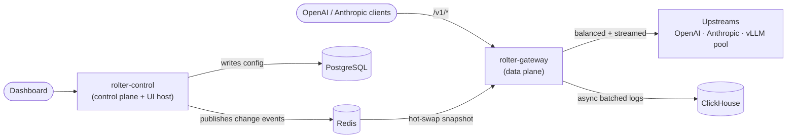

<p align="center">
  
</p>

# rolter

A high-performance, open-source **LiteLLM-proxy alternative** built in Rust with a TypeScript + [shadcn/ui](https://ui.shadcn.com) dashboard.

rolter is an OpenAI/Anthropic-compatible **AI gateway** that proxies commercial providers and load-balances self-hosted OpenAI-compatible fleets (e.g. 20–30 vLLM instances) with **cache-aware routing**, full RBAC, reload-free configuration, and cost/usage tracking.

> Status: early scaffold. The data-plane gateway MVP runs today (OpenAI/Anthropic passthrough + balancing + virtual keys + metrics). The control plane, dashboard, and persistence are being built out — see [`ROADMAP.md`](ROADMAP.md) and [`TODO.md`](TODO.md).

## Why rolter

- **Fast**: a Rust data plane (Axum/Hyper/Tower on Tokio) with lock-free config reads and minimal-copy streaming.
- **Cache-aware load balancing**: route prefix-heavy traffic to the vLLM replica most likely to have the KV cache warm — approximate today, precise (KV-events) on the roadmap.
- **Drop-in**: speak the OpenAI and Anthropic APIs your clients already use.
- **Operable**: virtual keys, budgets, rate limits, cost tracking, RBAC, and reload-free config changes from the UI.

## Architecture



See [`docs/architecture/overview.md`](docs/architecture/overview.md) for the full design.

## Quick start

The whole stack — gateway, control plane, and UI — comes up with one command
([`just`](https://github.com/casey/just) required):

```bash
just dev
```

This creates `rolter.toml` from the example on first run, installs UI deps
(Bun if present, else npm), and runs all three processes with labeled output.
**No provider API keys are needed to boot** — the built-in `fake-llm` model
answers locally, so you can try the gateway before configuring any upstream.

| Service | URL                     | Notes                              |
| ------- | ----------------------- | ---------------------------------- |
| UI      | http://localhost:3000   | Vite dev server, proxies `/api` → control |
| Gateway | http://localhost:4000   | OpenAI/Anthropic-compatible data plane    |
| Control | http://localhost:4001   | management API + built UI host            |

Send a request to the built-in model (works with no upstream configured):

```bash
curl -s http://localhost:4000/v1/chat/completions \
  -H "Authorization: Bearer sk-rolter-dev" \
  -H "Content-Type: application/json" \
  -d '{"model":"fake-llm","messages":[{"role":"user","content":"hello"}]}'
```

To route to a real provider, edit `rolter.toml` and export the key its
`api_key_env` references (e.g. `export OPENAI_API_KEY=sk-...`), then call the
model you configured. `GET /healthz` and Prometheus `GET /metrics` are also
exposed.

### Gateway only

```bash
cargo run -p rolter-gateway -- --config rolter.toml
```

## Install

```bash
# rust
cargo install --path crates/rolter-gateway

# uv (PyPI wheel built with maturin) — see docs/development/packaging.md
uv tool install rolter

# docker
docker compose -f docker/docker-compose.yml up -d
```

## Repository layout

- `crates/rolter-core` — config model, domain types, errors, telemetry
- `crates/rolter-balancer` — load-balancing strategies (incl. approximate cache-aware)
- `crates/rolter-proxy` — upstream forwarding, header injection, streaming
- `crates/rolter-store` — repository traits + in-memory store (Postgres/Redis/ClickHouse next)
- `crates/rolter-auth` — virtual keys, roles, access checks
- `crates/rolter-gateway` — data-plane binary
- `crates/rolter-control` — control-plane binary + static UI host
- `ui/` — Vite + React + shadcn/ui dashboard
- `docs/` — architecture, ADRs, API, development and deployment guides
- `migrations/`, `clickhouse/` — database schemas

## Development

```bash
cargo build --workspace
cargo test --workspace
cargo fmt --all
cargo clippy --workspace --all-targets -- -D warnings
```

Commits and PR titles follow [Conventional Commits](docs/development/commit-conventions.md). See [`AGENTS.md`](AGENTS.md) and [`docs/development/contributing.md`](docs/development/contributing.md).

## License

Apache-2.0 — see [`LICENSE`](LICENSE).
