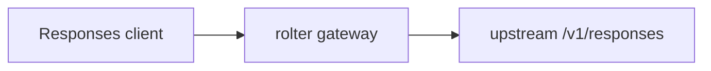

# Трансляция OpenAI Responses API

## Общее

| Поле | Значение |
|------|----------|
| **Продукт** | rolter |
| **Автор** | Ilya Lubenets |
| **Дата создания** | 13 Jul 2026 |
| **Статус** | DEVELOPMENT |
| **Участники** | @<укажите> |
| **ЛПР** | @<укажите> |
| **Принято** | — |
| **Устарело** | — |

## Контекст

ROL-252 добавляет публичный `POST /v1/responses`. В gateway уже есть маршрутизация по `model`, а в `rolter-proxy` — изолированный реестр преобразований OpenAI Chat Completions и Anthropic Messages с инкрементальной обработкой SSE. Responses несёт текст, мультимодальный ввод, tools, tool results и отдельную модель потоковых событий. Операции жизненного цикла используют идентификатор ответа без `model`, поэтому они не могут безопасно выбирать маршрут без хранения связи tenant/key → upstream response.

## Рассмотренные варианты

### Вариант 1. Только нативный passthrough

Передавать `/v1/responses` без преобразования всем провайдерам.



### Вариант 2. Реестр протоколов с Responses

Добавить Responses как протокол: нативный OpenAI получает passthrough, а Chat Completions и Anthropic Messages получают адаптированные запросы и возвращают Responses-объекты или SSE-события.

```mermaid
flowchart LR
    C[Responses client] --> G[rolter gateway]
    G -->|OpenAI| R[/v1/responses]
    G -->|Chat-compatible| CC[/v1/chat/completions]
    G -->|Anthropic| AM[/v1/messages]
    R --> G
    CC --> G
    AM --> G
```

## Сравнение вариантов

| Вариант | Плюсы | Минусы |
|---------|-------|--------|
| **1. Только нативный passthrough** | Нет преобразований и потерь для Responses-native upstream | Маршруты Chat и Anthropic не поддерживают новую поверхность |
| **2. Реестр протоколов с Responses** | Один публичный контракт для OpenAI, Chat и Anthropic; транспорт, метрики и учёт остаются общими | Не все Responses-возможности имеют эквивалент; нужно поддерживать SSE-конвертер |

## Решение

Выбран вариант 2. `Protocol::OpenAiResponses` добавляется в реестр `rolter-proxy`. Для `ProviderKind::Openai` используется нативный `/v1/responses`; для Chat-compatible провайдеров — `/v1/chat/completions`; для Anthropic — `/v1/messages`. Общие поля преобразуются, а ответы и потоковые события возвращаются в Responses-представлении.

## Обоснование

Это сохраняет существующую архитектурную границу: gateway отвечает за аутентификацию, tenant scope, выбор target, tracing, метрики и accounting, а `rolter-proxy` — только за wire-протокол. Нативный Responses не теряет провайдерские поля, при этом существующие Chat и Anthropic маршруты остаются доступными для клиентов нового OpenAI SDK.

## Последствия

**Преимущества:**

- общий Responses endpoint работает с тремя семействами upstream API;
- SSE переводится инкрементально, без буферизации живого потока;
- `input_tokens`/`output_tokens` учитываются существующим cost и rate-limit accounting.

**Недостатки и риски:**

- `background`, `store`, `previous_response_id` и provider-specific reasoning не имеют безопасного эквивалента Chat/Anthropic и не передаются туда;
- lifecycle для native OpenAI реализован отдельным tenant-scoped registry в ADR-0016; переведённые Chat/Anthropic ресурсы по-прежнему возвращают `501 response_lifecycle_unsupported`;
- поддержка новых Responses event types требует расширения конвертера и тестов.

**Влияние на систему:**

Изменяются `rolter-gateway`, `rolter-proxy`, OpenAPI и API-документация; storage schema не меняется.

## Связанные записи

- ADR-0014 — Extensible API protocol translation
- ROL-252 — OpenAI Responses API passthrough and streaming

## Открытые вопросы

- Рассмотреть распределённый backend registry для multi-replica deployment без sticky routing.
- Расширить потоковую трансляцию function-call и reasoning event types по мере подтверждения поддерживаемых upstream контрактов.
