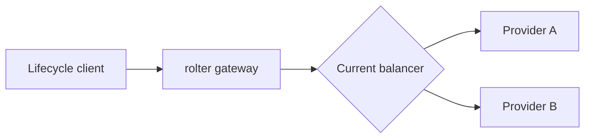
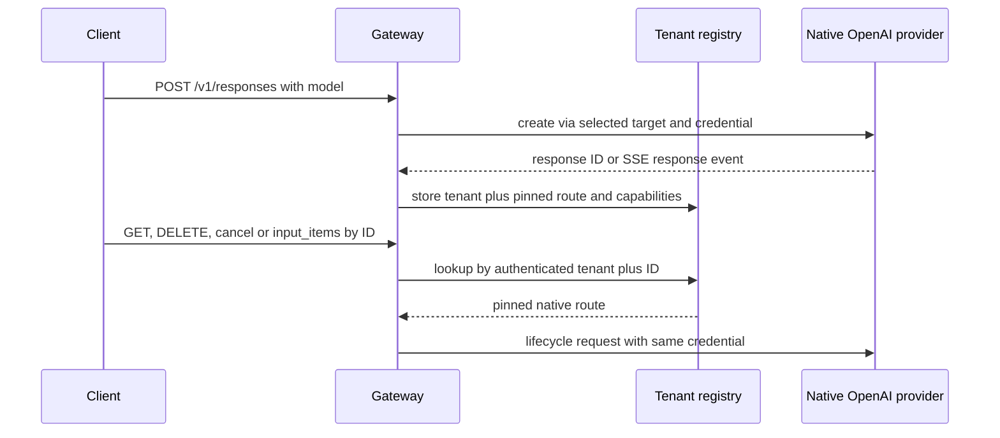
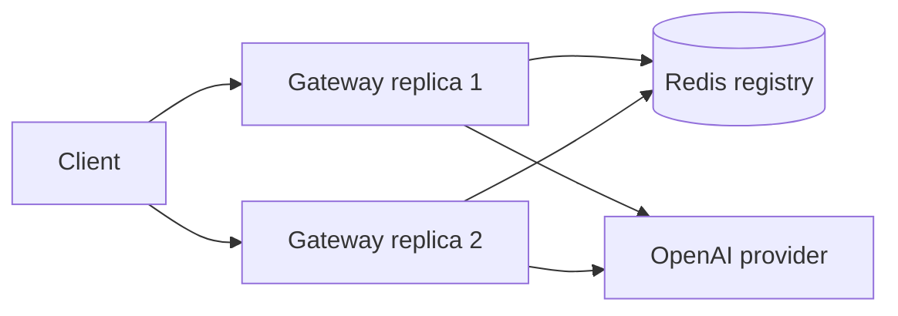

# Маршрутизация ресурсов OpenAI Responses по tenant-scoped registry

## Общее

| Поле | Значение |
|------|----------|
| **Продукт** | rolter |
| **Автор** | Ilya Lubenets |
| **Дата создания** | 13 Jul 2026 |
| **Статус** | DEVELOPMENT |
| **Участники** | @<укажите> |
| **ЛПР** | @<укажите> |
| **Принято** | — |
| **Устарело** | — |

## Контекст

ROL-252 добавил создание OpenAI Responses, маршрутизируемое по полю `model`. ROL-264 добавляет `GET` и `DELETE /v1/responses/{id}`, `POST /v1/responses/{id}/cancel` и `GET /v1/responses/{id}/input_items`. Эти запросы не содержат модель, tenant или provider, а идентификатор upstream нельзя безопасно использовать для повторного балансирования: запрос может уйти другому provider, target или provider key и раскрыть ресурс другого tenant.

Gateway уже аутентифицирует virtual key, атомарно обновляет routing snapshot и выбирает конкретный provider credential. Для безопасного lifecycle необходимо запомнить это решение после успешного `POST /v1/responses`, включая streaming-ответы. Переведённые Chat Completions и Anthropic Messages не создают сохраняемый upstream Responses resource.

## Рассмотренные варианты

### Вариант 1. Повторно выбирать маршрут по response ID

Хешировать `response_id` и использовать текущий balancer или перебор providers.

### Вариант 2. Ограниченный process-local tenant registry

После успешного создания сохранить composite key `virtual-key digest + response_id` и pin на provider, target, model и fingerprint provider credential. Запись имеет TTL и удаляется после успешного DELETE.

### Вариант 3. Распределённый registry в Redis

Хранить те же записи в общем Redis с TTL, чтобы lifecycle запрос мог обслужить любой gateway replica.

## Сравнение вариантов

| Вариант | Плюсы | Минусы |
|---------|-------|--------|
| **1. Повторный выбор** | Нет нового состояния | Нельзя гарантировать tenant isolation, provider и credential; небезопасно |
| **2. Process-local registry** | Не добавляет сетевой hop и обязательную инфраструктуру в data-plane; синхронная запись доступна сразу после завершения ответа | Нужна sticky routing между replicas; записи теряются при restart |
| **3. Redis registry** | Работает между replicas и переживает restart gateway | Redis становится обязательным для lifecycle; добавляет latency, failure mode и гонку записи после завершения SSE |

## Решение

Выбран вариант 2. `rolter-gateway` хранит ограниченный process-local registry. Ключ состоит из peppered digest виртуального ключа и публичного `response_id`; plaintext key не сохраняется. Значение фиксирует provider, target, public model, provider-native ID, fingerprint выбранного provider credential и capability flags.

По умолчанию запись живёт 24 часа, один процесс хранит не более 100 000 записей. Параметры задаются через `[responses] registry_ttl_secs` и `registry_max_entries`; нулевое значение отключает регистрацию. Истечение и переполнение очищаются лениво на lookup/insert. Успешный DELETE удаляет запись немедленно.

## Обоснование

Process-local registry закрывает основной security invariant без обязательного Redis на пути inference. Composite key делает unknown, expired и cross-tenant lookup неразличимыми. Pin на provider credential предотвращает обращение к ресурсу через другой upstream account. Fingerprint позволяет найти тот же credential после перестановки key pool, не сохраняя секрет второй раз.

Translated Chat Completions и Anthropic Messages получают запись с пустыми lifecycle capabilities. Это позволяет вернуть владельцу точный `501 response_lifecycle_unsupported`, сохраняя для другого tenant единый `404 response_not_found`.

## Последствия

**Преимущества:**

- lifecycle запрос не проходит повторную балансировку и всегда использует исходный provider account;
- unknown, expired, deleted, cross-tenant и недоступные после config change ресурсы возвращают одинаковый `404` без route metadata;
- native upstream status и body передаются без преобразования;
- non-streaming JSON и завершённый SSE регистрируются одной completion-observer точкой.

**Недостатки и риски:**

- multi-replica deployment требует sticky routing по клиенту или response ID;
- restart gateway удаляет registry раньше upstream retention;
- полный ответ временно буферизуется существующим accounting stream; registry использует уже имеющийся buffer, но размер памяти не уменьшается;
- удаление provider, смена его kind или ротация исходного credential делает запись недоступной и возвращает `404`.

**Влияние на систему:**

Изменяются `rolter-core` (конфигурация retention), `rolter-gateway` (registry, lifecycle handlers и response observer), `rolter-proxy` (model-less forwarding), OpenAPI, API-документация и engine smoke. Схемы Postgres/Redis не меняются.

## Связанные записи

- ADR-0005 — Org → Team → Project → Virtual Key tenancy
- ADR-0014 — Extensible API protocol translation
- ADR-0015 — Трансляция OpenAI Responses API
- ROL-252 — OpenAI Responses API passthrough and streaming
- ROL-264 — Responses API lifecycle resources

## Открытые вопросы

- Добавить опциональный Redis backend registry, если lifecycle должен работать без sticky routing между replicas.
- Расширить capability discovery, когда OpenAI-compatible providers начнут надёжно реализовывать native Responses lifecycle.
