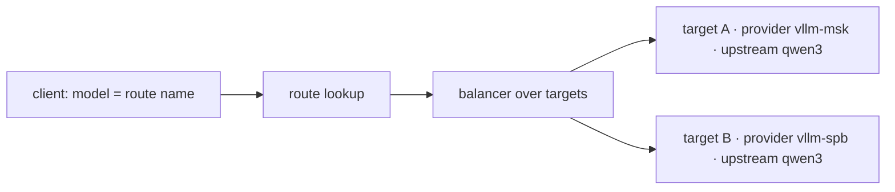
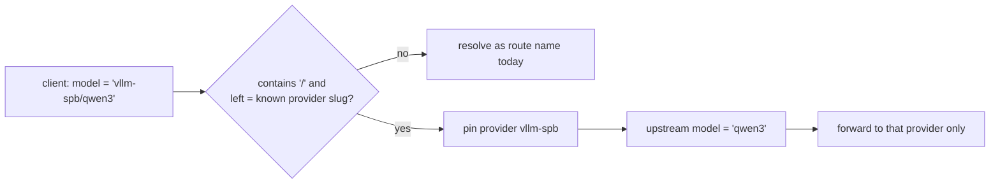

# Provider/model addressing to disambiguate identical model names

## Metadata

| Field | Value |
|-------|-------|
| **Product** | rolter |
| **Author** | Ilya Lubenets |
| **Date** | 14 Jul 2026 |
| **Status** | ACCEPTED |
| **Issue** | [ROL-266](https://linear.app/rolter/issue/ROL-266) |
| **Decision maker** | @Ilya |
| **Decided** | 14 Jul 2026 |

## Context

When several providers serve the **same model name**, a client has no first-class
way to say *which* one it wants. This is common with self-hosted OpenAI-compatible
backends: two vLLM/SGLang instances at different base URLs both serving `qwen3`, or
an `openai`-kind provider whose `base_url` points at a non-OpenAI upstream.

### How rolter addresses models today

- A client sends `model` = a **route name** (`routes.model`, unique per project).
- A route fans out to one or more `route_targets`, each `{provider_id, upstream_model?, weight}`.
- The proxy rewrites the outgoing `model` to `upstream_model` when set
  (`crates/rolter-proxy/src/lib.rs:333`, `maybe_rewrite_model`); target selection and
  failover happen in `crates/rolter-gateway/src/handlers.rs` (weighted balancer over
  `entry.route.targets`).
- Providers are `unique(org_id, name)`; there is no URL-safe `slug`.

So disambiguation today means the **operator invents distinct route names**
(`qwen3-msk`, `qwen3-spb`). There is no client-facing `provider/model` addressing and
no convention linking a route name to a concrete provider.

### Prior art

- **LiteLLM** — a two-tier scheme: clients send a public `model_name` alias; each
  deployment carries `litellm_params.model` with a provider prefix (`openai/gpt-4o`)
  plus its own `api_base`/credentials. Multiple deployments sharing one `model_name`
  are load-balanced. The prefix is a **routing hint tied to a base_url**, so you can
  point `openai/...` at a Qwen endpoint by swapping `base_url` — the prefix is
  semantically muddy and is *not* a stable identity.
- **Envoy AI Gateway** — extracts the `model` field from the request body into an
  `x-ai-eg-model` header *before* routing, then applies ordinary header-match rules in
  an `AIGatewayRoute` to pick a backend. Selection is **out-of-band** (header/route
  config), not encoded in the model string the client sends.

The lesson: keep the address segments **stable identities**, not free-form hints
(avoid LiteLLM's base_url ambiguity), while still letting a route fan out.

## Options considered

### Option A — Status quo (distinct route names)

Operators keep inventing unique route names per provider (`qwen3-msk`).

- **Pro**: zero code; already works; route name stays the single routing key.
- **Con**: no convention; clients must know deployment-specific names; poor discovery;
  the provider is invisible in the address.

### Option B — First-class `provider-slug/model` addressing (coexisting)

Introduce a stable, URL-safe **`slug`** on providers. A client may send either a bare
route name (unchanged) **or** `provider-slug/model`. The gateway resolves
`provider-slug/model` to the concrete `(provider, upstream_model)` pair, pinning the
provider and using `model` as the upstream model.

- **Pro**: unambiguous, self-describing addressing; slug is a stable identity (fixed
  kind + base_url), avoiding LiteLLM's base_url muddiness; coexists with named routes,
  so it is additive and backward-compatible; maps cleanly to "pick a provider from the
  list, or add one inline, then reference its models" in the UI.
- **Con**: needs a new `slug` column (migration + uniqueness/charset rules + CRUD/UI);
  parsing precedence and slash-collision rules to define; a pinned provider bypasses
  multi-provider fan-out (see open questions — it can still fan out across that
  provider's own key pool / targets).

### Option C — Auto-derived `provider/model` aliases (read-only convenience)

No new column: derive an alias by slugifying the existing provider `name` and pairing
it with each target's `upstream_model`, exposed only through `/v1/models` and accepted
on input.

- **Pro**: no schema change; quick.
- **Con**: provider `name` is mutable and only `unique(org_id, name)` — renames silently
  break addresses; slugifying a display name yields collisions and unstable ids. Same
  fragility LiteLLM has. Rejected as the primary path.

### Option D — Out-of-band provider selector header

Keep `model` as today; add an optional `x-rolter-provider: <slug>` header (Envoy-style)
to pin the provider.

- **Pro**: no change to the `model` string; no slash-parsing.
- **Con**: not expressible in stock OpenAI/Anthropic SDK `model` fields, so clients that
  can only set `model` (the common case) cannot use it; discovery is worse. Useful as a
  **complement** to B, not a replacement.

## Comparison

| Criterion | A (route names) | B (slug/model) | C (derived) | D (header) |
|---|---|---|---|---|
| Client-facing disambiguation | ✗ | ✓ | ✓ | ✓ (header only) |
| Stable identity (rename-safe) | n/a | ✓ | ✗ | ✓ |
| Works via stock `model` field | ✓ | ✓ | ✓ | ✗ |
| Backward compatible | ✓ | ✓ | ✓ | ✓ |
| Schema/UI cost | none | slug column + CRUD/UI | none | header plumbing |
| Avoids LiteLLM base_url ambiguity | n/a | ✓ | ✗ | ✓ |

## Recommendation

**Adopt Option B** — first-class `provider-slug/model` addressing that **coexists** with
today's named routes — and optionally add **Option D** later as a complementary header
for clients that need to pin a provider without touching `model`.

Rationale: B gives unambiguous, self-describing, rename-safe addressing that fits the
OpenAI/Anthropic `model` field clients already use, and matches the desired UX ("pick an
existing provider or add one inline, then reference `provider-slug/model`"). It is purely
additive: existing bare-`model` routes keep working.

### Proposed resolution semantics (to confirm)

1. **Precedence**: try the whole `model` string as a route name first (preserves any
   existing route whose name contains `/`). If unmatched and the string contains `/`,
   split on the **first** `/`: if the left segment is a known provider slug in the
   caller's scope, treat the right segment as the upstream model and pin that provider;
   otherwise fall through to the normal not-found path.
2. **Slug**: `^[a-z0-9][a-z0-9-]{0,62}$`, `unique(org_id, slug)`, immutable-by-default
   (renaming display name never changes the slug). Backfill existing providers from a
   slugified name with numeric de-dup on migration.
3. **Balancing**: a `provider-slug/model` request **pins the provider** and bypasses
   cross-provider fan-out, but still uses that provider's key pool, cooldowns, and (if
   the provider has multiple same-model targets) intra-provider selection. Bare route
   names keep full multi-provider balancing.
4. **`/v1/models`**: list both — existing route ids *and* `provider-slug/model` ids
   (grouped by provider in a follow-up UI), so either address is discoverable.

### Slug collision handling

Slugs are `unique(org_id, slug)`, so the DB is the final arbiter — but "just add a
unique index" leaves the *behaviour* around collisions unspecified. This section pins it
down for the three moments a collision can happen. Note first that slugs are **org-scoped**:
there is no cross-org collision, and `provider-slug/model` always resolves within the
caller's org (enforced in the query `where org_id = $caller`), so the blast radius of any
collision is a single org.

**1. Migration backfill (deterministic).** Shipped in
`crates/rolter-store/migrations/0014_provider_slug.sql`:

- Providers are processed per org in a stable order (`id` ascending via
  `row_number() over (partition by org_id, base order by id)`), so the result is
  reproducible.
- Slugify `name`: lowercase, map every run outside `[a-z0-9]` to a single `-`, trim
  leading/trailing `-`; an empty result falls back to `provider`.
- The **first** claimant of a base slug keeps it bare (truncated to 63); each subsequent
  collision gets a `-N` suffix from its row number (`vllm`, `vllm-2`, `vllm-3`, …), the
  base truncated to 58 chars so `base-N` still fits. The migration never fails on a
  collision — it always converges.
- *Follow-up*: emit a migration report (one line per adjusted provider: `org_id,
  provider_id, name, base_slug, final_slug`) so operators can reconcile any
  externally-published address.

**2. Runtime creation (validate, never silently mangle).** Shipped in
`crates/rolter-control/src/crud.rs`:

- An explicit `slug` is validated against `^[a-z0-9][a-z0-9-]{0,62}$`; an omitted one is
  derived from `name` (a name with no ascii alphanumerics requires an explicit slug). A
  conflict surfaces as the DB unique-violation error — the API never auto-appends a
  suffix behind the operator's back, because an address is a contract the human picks
  explicitly.
- *Follow-up*: map the unique violation to **409** with the next free suggestion
  (`{"error": "slug taken", "suggestion": "vllm-2"}`), and have the UI pre-check
  availability before submit.
- Slug is **immutable by default** (it is the stable identity). An in-place change
  requires the explicit `allow_slug_change=true` opt-in on update, which warns that the
  `provider-slug/model` address changes with it.

**3. Deletion & reclaim (explicit, not automatic).** A hard-deleted provider frees its
slug immediately; the next create may reuse it. This is intentional but load-bearing:
reusing `openai` after deleting the old `openai` repoints that address to a **new
upstream**. Therefore:

- Prefer **soft-delete** for providers that ever served traffic, so a freed slug is not
  silently re-pointed; a reused slug is then an explicit operator action on a
  tombstoned name.
- Reclaim is a **new identity**, never a restore — document that `provider-slug/model`
  after reclaim may resolve to different weights/base_url than before.

## Decision (14 Jul 2026)

- **Adopt Option B, coexisting** with named routes. `provider-slug/model` resolves to a
  pinned `(provider, upstream_model)`; bare route names keep full multi-provider
  balancing. Named routes are **not** replaced.
- **Balancing when pinned**: a `provider-slug/model` request pins the provider and
  **bypasses cross-provider fan-out, but still fans out within that provider** — its key
  pool, cooldowns, and any same-model targets stay in rotation.
- **Precedence & slug rules** as proposed above (route-name-first, then first-`/` split;
  slug `^[a-z0-9][a-z0-9-]{0,62}$`, `unique(org_id, slug)`, immutable by default).
- **Collision policy** as in *Slug collision handling* above: slugs are org-scoped
  (no cross-org collision); migration backfill is deterministic with `-N` de-dup
  (shipped in migration `0014`); runtime creation validates and rejects conflicts rather
  than silently suffixing (409 + suggestion as follow-up); slug changes need the explicit
  `allow_slug_change` opt-in; hard-delete frees a slug immediately, but soft-delete is
  preferred so a reclaimed slug is an explicit operator action, not a silent re-point.
- **Option D (header selector)**: deferred, not part of the initial implementation.

## Addendum (20 Jul 2026) — provider groups: unifying slugs under one address

### Problem

Per-provider slugs alone push fleet operators the wrong way. Run ten vLLM instances
(distinct `base_url` + credentials each) and you get ten providers — `vllm-1` …
`vllm-10` — where pinning any single one is the *opposite* of what the operator wants.
Named routes can unify them, but a route binds **one public model name** to targets, so a
cluster serving 30 models needs 30 hand-made routes. LiteLLM's "model group / alias"
answers the per-model case; nothing answers "this whole fleet, all of its models, one
address".

### Decision

Introduce **provider groups** — an org-scoped, named set of providers that shares the
slug namespace with providers (`unique(org_id, slug)` enforced across both), so the
left segment of `X/model` resolves through a single unified lookup and is never
ambiguous.

- **Membership**: groups are fully operator-defined — any slug, any member set — and
  membership is **many-to-many**: one provider may belong to several groups. Overlapping
  groups are the intended way to express scopes, e.g. `vllm-cluster-msk` (five Moscow
  instances), `vllm-cluster-nsk` (five Novosibirsk instances), and `vllm-cluster-all`
  (all ten) — the client picks the scope by address. **No group nesting** (groups of
  groups) initially: flat membership covers the scoping cases, nesting adds
  cycle-detection and resolution complexity for little gain; deferred.
- **Resolution**: precedence unchanged — whole string as route name first, then split on
  first `/`. The left segment is looked up in the unified slug namespace: a provider slug
  pins that provider (as decided above); a **group slug fans out across the group's
  members**, balanced with the group's configured strategy (any
  `rolter_balancer::LoadBalancer`), honoring per-member weight, each member's key pool,
  and cooldowns.
- **Model handling**: default is **passthrough** — the right segment is forwarded
  unchanged as the upstream model (the homogeneous-cluster case: every member serves the
  same model set). An optional per-member `upstream_model` rewrite covers heterogeneous
  groups, mirroring `route_targets`.
- **Credentials**: unchanged. Clients authenticate with a rolter virtual key; member
  credentials stay per provider. A group gives *one address, one client key, N upstreams
  with N distinct upstream creds* — which is the unification the fleet operator actually
  needs.
- **Relation to routes**: a group is effectively a wildcard route family
  (`vllm-cluster/*`) without creating a route per model. Named routes remain the
  curated-alias layer for cherry-picked public names; groups cover fleets.
- **`/v1/models`**: group addresses are listed as the deduplicated union of member-served
  models (`vllm-cluster/qwen3`, `vllm-cluster/llama4`, …) alongside provider-slug and
  route ids.
- **Collision interplay**: groups also soften the collision pressure from the section
  above — individual instances can carry mundane slugs (`vllm-msk-1`), while the group
  owns the meaningful address (`vllm-cluster`, or even `vllm`).

## Proposed follow-up implementation issues

1. **store**: add immutable `slug` to providers — migration, `unique(org_id, slug)`,
   deterministic reported backfill with `-N` de-dup, 409+suggestion on create-conflict,
   soft-delete-preferred reclaim, CRUD wiring. (relates to ROL-81, see *Slug collision
   handling*)
2. **proxy/gateway**: `provider-slug/model` parsing + resolution with the precedence rule
   and provider pinning; interaction with `maybe_rewrite_model`/`upstream_model`; tests.
3. **gateway**: extend `/v1/models` to surface `provider-slug/model` ids.
4. **ui**: model-management surfaces the `provider-slug/model` address; inline
   add-provider flow. (relates to ROL-222)
5. *(optional)* **proxy**: `x-rolter-provider` header selector (Option D).
6. **store/gateway/ui**: provider groups — `provider_groups` entity (slug in the unified
   namespace, strategy, members with weights), `group-slug/model` resolution with
   passthrough + per-member rewrite, `/v1/models` union listing, group CRUD/UI.
   (see *Addendum: provider groups*)

## Sources

- [LiteLLM proxy config — model_name / litellm_params / load balancing / wildcard](https://docs.litellm.ai/docs/proxy/configs)
- [Envoy AI Gateway — model-name-based routing via `x-ai-eg-model`](https://aigateway.envoyproxy.io/docs/capabilities/)
