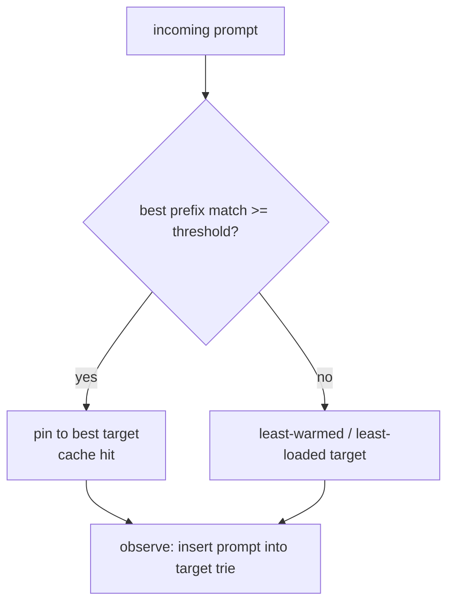

# Caching

rolter deals with two distinct kinds of caching.

## 1. KV-cache affinity (load balancing)

The big win for self-hosted fleets: vLLM/SGLang reuse the attention KV cache for shared prompt prefixes (system prompts, few-shot examples, conversation history). But that only helps if the next matching request lands on the **same** replica. Naive round-robin scatters related requests and destroys cache locality.

The `cache_aware` strategy keeps, per target, a byte **trie** of prompts it has served. For an incoming prompt it computes the fraction of leading bytes already present on each target and:

- if the best match ≥ `threshold` (default `0.5`), pins the request to that target (cache hit)
- otherwise spreads to the least-warmed target (or least loaded once load is wired)

This is **approximate** (no coupling to the engine). The per-target trie is capped at a node ceiling (default 1M nodes) with **LRU eviction**: inserting past the cap drops the least-recently-inserted prompt, pruning only the nodes that become unreferenced (shared prefixes survive). Each trie exposes an eviction counter for observability.



### Precise mode (roadmap)

Subscribe to vLLM KV-cache events over ZMQ, hash blocks the same way vLLM does (`--block-size`, hash seed), and maintain a global block→target index. Score targets by exact resident-prefix fraction blended with live load. This mirrors llm-d's precise prefix-cache-aware scheduling and gives the largest, most reliable TTFT/throughput wins on prefix-heavy workloads.

## 2. Response cache

Optional caching of full responses to cut cost/latency for repeated requests:

- **exact**: hash of the normalized request → cached response (Redis), short TTL, opt-in per route/key.
- **semantic**: after an exact miss, embed the normalized prompt through a configured provider and compare cosine similarity against a bounded recent-entry window in Redis. The route controls the threshold and candidate cap. Embedding, Redis, and decode failures fail open to normal routing.

Streaming responses are cached on completion and replayed as a synthetic stream. Cache status is surfaced via response headers (e.g. `x-rolter-cache: hit|miss`).

```toml
[cache]
enabled = true

[routes.cache]
enabled = true

[routes.cache.semantic]
provider = "openai"
model = "text-embedding-3-small"
threshold = 0.92
max_candidates = 256
```
