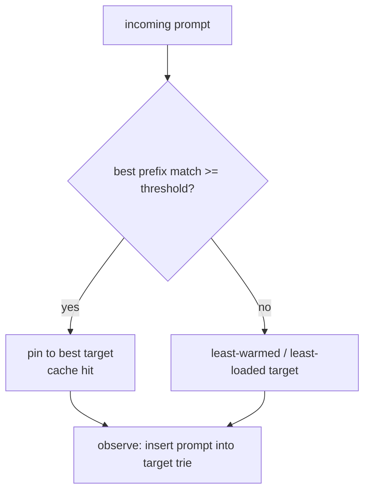

# Caching

rolter deals with two distinct kinds of caching.

## 1. KV-cache affinity (load balancing)

The big win for self-hosted fleets: vLLM/SGLang reuse the attention KV cache for shared prompt prefixes (system prompts, few-shot examples, conversation history). But that only helps if the next matching request lands on the **same** replica. Naive round-robin scatters related requests and destroys cache locality.

The `cache_aware` strategy keeps, per target, a byte **trie** of prompts it has served. For an incoming prompt it computes the fraction of leading bytes already present on each target and:

- if the best match ≥ `threshold` (default `0.5`), pins the request to that target (cache hit)
- otherwise spreads to the least-warmed target (or least loaded once load is wired)

This is **approximate** (no coupling to the engine). The per-target trie is capped at a node ceiling (default 1M nodes) with **LRU eviction**: inserting past the cap drops the least-recently-inserted prompt, pruning only the nodes that become unreferenced (shared prefixes survive). Each trie exposes an eviction counter for observability.



### Precise vLLM mode

Set a provider's `[providers.kv_events]` block and choose `strategy = "precise_cache_aware"`. rolter supports the vLLM V1 msgpack `KVEventBatch` protocol documented for vLLM 0.22: a three-frame ZMQ publication (`topic`, big-endian sequence, payload) containing tagged `BlockStored`, `BlockRemoved`, and `AllBlocksCleared` events. `BlockStored.token_ids` and `block_size` derive stable local prefix identities; external block hashes allow exact removals. State is capped by `max_blocks` per provider.

Exact scoring needs the token ids produced by the same tokenizer as vLLM. Send them in `x-rolter-vllm-token-ids` as comma-separated unsigned integers. Without the header, with stale/malformed events, or after a sequence gap, the scorer is neutral and least-load routing takes over. A sequence gap clears the local index and precise scoring remains disabled until an `AllBlocksCleared` event establishes a clean boundary.

```toml
[[providers]]
name = "vllm-a"
kind = "openai_compatible"
api_base = "http://vllm-a:8000"

[providers.kv_events]
endpoint = "tcp://vllm-a:5557"
topic = "kv-events"
max_blocks = 1000000
stale_secs = 30
```

vLLM must enable KV events with the ZMQ publisher and matching topic. Metrics expose consumed/malformed events, stream failures, decision count, and per-provider freshness.

### LMCache-aware mode

Set `[providers.lmcache]` and use `strategy = "lmcache_aware"`. The supported controller signal is an HTTP `200` JSON object:

```json
{"occupancy": 0.42, "cache_available": true}
```

`occupancy` is clamped to `[0,1]`; available targets score `1 - occupancy`, unavailable targets score zero. Polling happens in the background. Failed, malformed, or stale signals are neutral, so existing least-load routing continues.

```toml
[providers.lmcache]
endpoint = "http://lmcache-a:9000/v1/occupancy"
refresh_secs = 2
stale_secs = 10
```

## 2. Response cache

Optional caching of full responses to cut cost/latency for repeated requests:

- **exact**: hash of the normalized request → cached response (Redis), short TTL, opt-in per route/key.
- **semantic**: after an exact miss, embed the normalized prompt through a configured provider and compare cosine similarity against a bounded recent-entry window in Redis. The route controls the threshold and candidate cap. Embedding, Redis, and decode failures fail open to normal routing.

Streaming responses are cached on completion and replayed as a synthetic stream. Cache status is surfaced via response headers (e.g. `x-rolter-cache: hit|miss`).

```toml
[cache]
enabled = true

[routes.cache]
enabled = true

[routes.cache.semantic]
provider = "openai"
model = "text-embedding-3-small"
threshold = 0.92
max_candidates = 256
```
