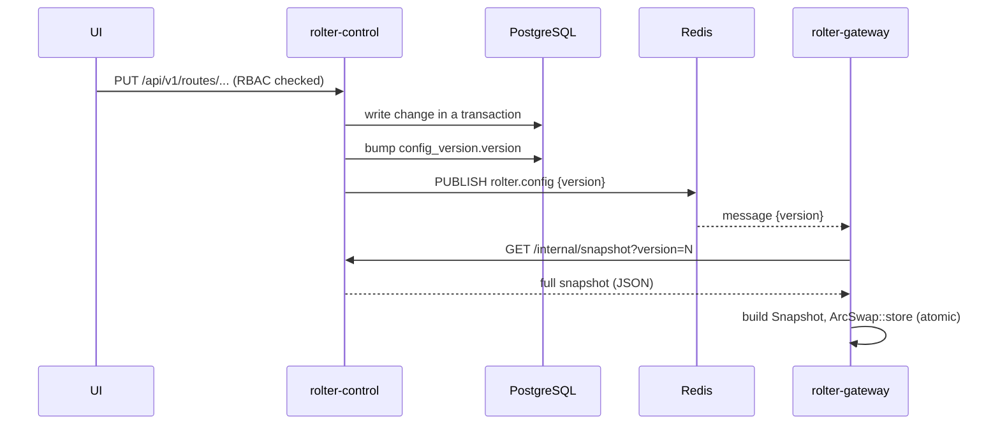

# Configuration & hot reload

A core requirement: operators change routes, providers, keys, limits and pricing from the UI and have them take effect **without restarting** the gateway.

## Sources of config

1. **Bootstrap file** (`rolter.toml`) — used for first run, local dev, and IaC. Maps to `rolter_core::GatewayConfig`.
2. **Database (Postgres)** — the runtime source of truth once the control plane is running. The control plane composes a `GatewayConfig`-equivalent snapshot from normalized tables.

## Propagation

- The gateway keeps the routing table in an `ArcSwap<Snapshot>`. Swapping is atomic and wait-free for readers — in-flight requests keep using the old snapshot; new requests see the new one.
- **Versioning**: `config_version` in Postgres is the monotonic source of truth. The gateway also reconciles on an interval (and at startup) so a missed pub/sub message self-heals.
- **Validation**: the control plane validates a snapshot (every route target references a known provider, etc.) before bumping the version, so gateways never load a broken config.

## Why this design

- Redis pub/sub gives near-instant fan-out to many gateway replicas.
- Postgres versioning makes the system correct even if Redis drops a message.
- `ArcSwap` keeps the hot path lock-free; no read ever blocks on a config write.

Alternatives considered: Postgres `LISTEN/NOTIFY` (avoids a Redis dependency but Redis is already needed for cache/rate limits), and pure polling (simplest, higher latency). See [ADR](../adr/README.md).
