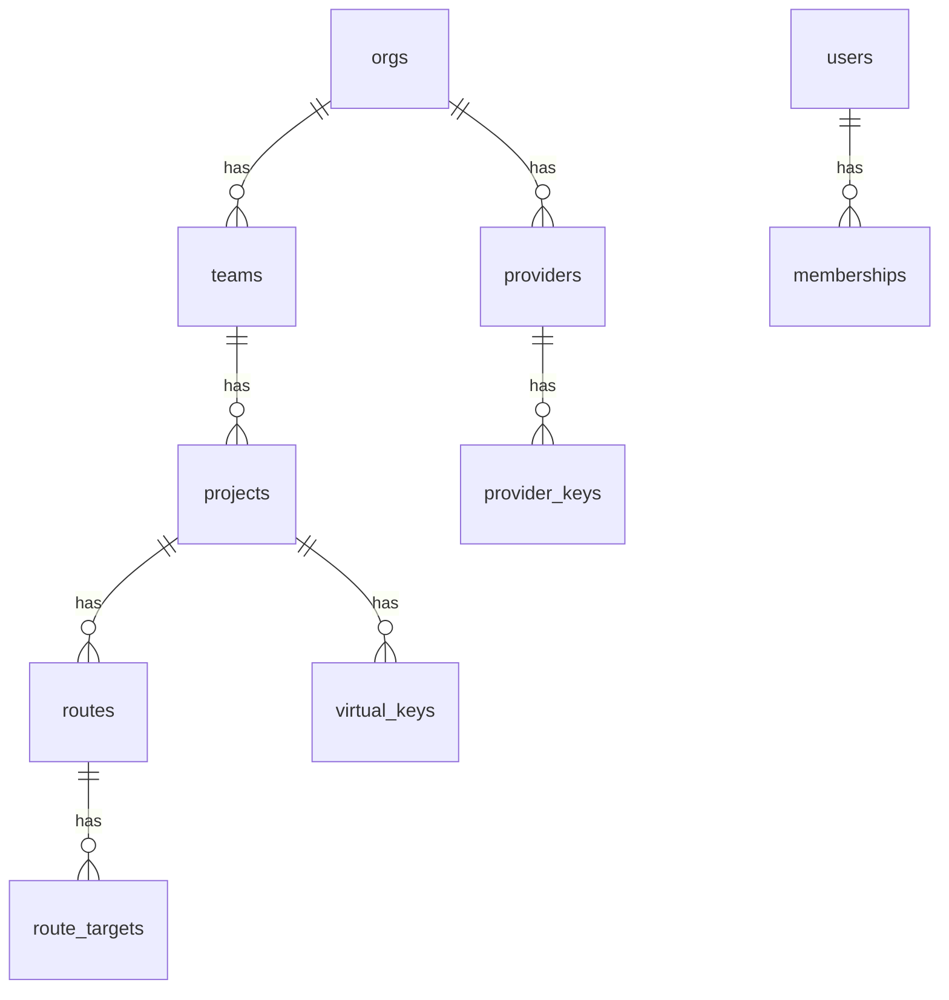

# Data model

PostgreSQL is the source of truth. The initial schema lives in [`migrations/0001_init.sql`](../../migrations/0001_init.sql); ClickHouse log schema in [`clickhouse/001_logs.sql`](../../clickhouse/001_logs.sql).

## Tenancy

- **Org → Team → Project → Virtual Key** is the hierarchy. Budgets and rate limits attach at any scope and combine **most-restrictive-wins**.
- **Providers** are owned at the org level and referenced by route targets. Upstream credentials live in `provider_keys`, **envelope-encrypted** (see [security.md](security.md)).
- **Routes** belong to a project and map a public `model` to `route_targets` with a `strategy`.
- **Virtual keys** belong to a project, store only a hash of the key plus a display prefix, and carry an optional model allow-list.

## Cost & limits

- `model_prices` — USD per million tokens for input/output (+ cached input). Used to compute `cost_usd` per request, written to ClickHouse.
- `budgets` — spend caps per scope and period; enforced before forwarding and refreshed from spend aggregates.
- `rate_limits` — RPM/TPM per scope; counters live in Redis for multi-instance correctness.

## Config versioning

`config_version` holds a single monotonic counter the gateways watch for reload-free updates ([config-and-hot-reload.md](config-and-hot-reload.md)). `audit_log` records who changed what.

## Mapping to the gateway

The control plane composes the normalized tables into the same shape as `rolter_core::GatewayConfig` (providers + routes + virtual_keys), which the gateway turns into an immutable `Snapshot`.
