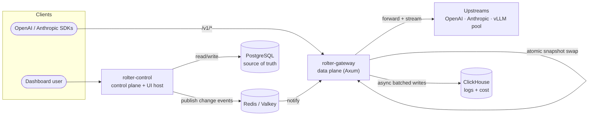
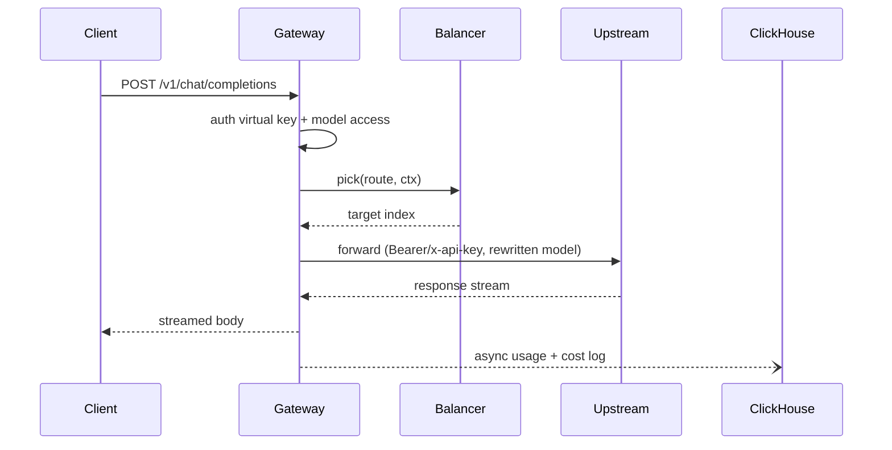

# Architecture overview

rolter is split into a **data plane** (the hot proxy path) and a **control plane** (management, RBAC, config writes, UI host), sharing a set of Rust library crates. This separation lets the proxy stay lean and fast while the control plane handles CRUD, auth, and persistence.

## Components

## Crates

- `rolter-core` — config model, domain types, error type, telemetry init. No I/O.
- `rolter-balancer` — `LoadBalancer` trait + strategies; pure and unit-tested.
- `rolter-proxy` — `Forwarder` over pooled `reqwest` clients; header injection, model rewrite, streaming, per-provider egress proxy.
- `rolter-store` — repository traits + in-memory impl; Postgres/Redis/ClickHouse backends land behind features.
- `rolter-auth` — virtual-key verification, roles, access checks.
- `rolter-gateway` (bin) — the data plane.
- `rolter-control` (bin) — the control plane + static UI host.

## Data plane (rolter-gateway)

Built on Axum/Hyper/Tower. Holds an `ArcSwap<Snapshot>` routing table; reads are lock-free. Per request it:

1. parses the JSON body enough to read `model` and `stream`
2. authenticates the virtual key (when keys are configured) and checks model access
3. resolves the route, asks the route's balancer to `pick` a target, then `observe`s it (cache-aware learning)
4. forwards to the upstream provider with the right auth header, rewriting the model id
5. streams the response body straight back with minimal copying

See [data plane details in performance.md](performance.md).

## Control plane (rolter-control)

Hosts the management REST API consumed by the dashboard and serves the built SPA as static assets (`ServeDir`). It owns all writes to Postgres, enforces RBAC, and publishes a config-change event to Redis so gateways hot-swap their snapshot without a restart (see [config-and-hot-reload.md](config-and-hot-reload.md)).

## Datastores

- **PostgreSQL** — source of truth for tenancy, RBAC, providers, routes, virtual keys, pricing, budgets.
- **Redis / Valkey** — response cache, rate-limit counters, cooldown state, and pub/sub for config propagation.
- **ClickHouse** — high-volume request and cost logs, queried by the dashboard for usage analytics.

## Request lifecycle (sequence)

## Extensibility

- New balancing strategy: implement `rolter_balancer::LoadBalancer`, wire into `build()`.
- New provider protocol: extend `ProviderKind` and `rolter-proxy` translation.
- New storage backend: implement `rolter-store` traits behind a cargo feature.
- New modality (audio/image/video): add endpoints + provider adapters; the balancer/auth/logging layers are modality-agnostic.
