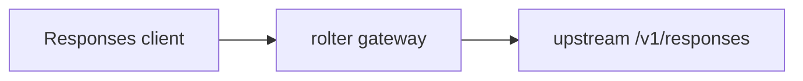
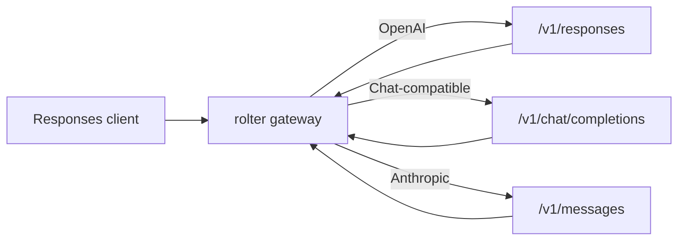

# OpenAI Responses API translation

**Status:** Development · **Date:** 13 Jul 2026 · **Issues:** [ROL-252](https://linear.app/rolter/issue/ROL-252)

## Context

ROL-252 adds the public `POST /v1/responses`. The gateway already routes on `model`, and `rolter-proxy` already holds an isolated registry of OpenAI Chat Completions and Anthropic Messages translations with incremental SSE handling. Responses carries text, multimodal input, tools, tool results and its own streaming event model. Lifecycle operations use a response identifier without a `model`, so they cannot safely select a route without storing the tenant/key → upstream response association.

## Options considered

### Option 1 — Native passthrough only

Forward `/v1/responses` to every provider without translation.

### Option 2 — Protocol registry with Responses

Add Responses as a protocol: native OpenAI gets passthrough, while Chat Completions and Anthropic Messages get adapted requests and return Responses objects or SSE events.

## Comparison

| Option | Pros | Cons |
|--------|------|------|
| **1. Native passthrough only** | No translation and no loss for a Responses-native upstream | Chat and Anthropic routes do not support the new surface |
| **2. Protocol registry with Responses** | One public contract for OpenAI, Chat and Anthropic; transport, metrics and accounting stay shared | Not every Responses capability has an equivalent; an SSE converter has to be maintained |

## Decision

Option 2 was chosen. `Protocol::OpenAiResponses` is added to the `rolter-proxy` registry. `ProviderKind::Openai` uses the native `/v1/responses`; Chat-compatible providers use `/v1/chat/completions`; Anthropic uses `/v1/messages`. Common fields are translated, and responses and streaming events are returned in the Responses representation.

## Rationale

This preserves the existing architectural boundary: the gateway owns authentication, tenant scope, target selection, tracing, metrics and accounting, while `rolter-proxy` owns only the wire protocol. Native Responses loses no provider-specific fields, and the existing Chat and Anthropic routes stay reachable for clients on the new OpenAI SDK.

## Consequences

**Benefits:**

- one shared Responses endpoint works across three families of upstream APIs;
- SSE is translated incrementally, without buffering the live stream;
- `input_tokens`/`output_tokens` are counted by the existing cost and rate-limit accounting.

**Drawbacks and risks:**

- `background`, `store`, `previous_response_id` and provider-specific reasoning have no safe Chat/Anthropic equivalent and are not forwarded there;
- lifecycle for native OpenAI is implemented by a separate tenant-scoped registry in ADR-0016; translated Chat/Anthropic resources still return `501 response_lifecycle_unsupported`;
- supporting new Responses event types requires extending the converter and its tests.

**System impact:**

`rolter-gateway`, `rolter-proxy`, the OpenAPI spec and the API documentation change; the storage schema does not.

## Related records

- ADR-0014 — Extensible API protocol translation
- ROL-252 — OpenAI Responses API passthrough and streaming

## Open questions

- Consider a distributed backend registry for multi-replica deployments without sticky routing.
- Extend streaming translation of function-call and reasoning event types as supported upstream contracts are confirmed.
