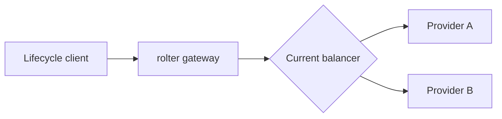
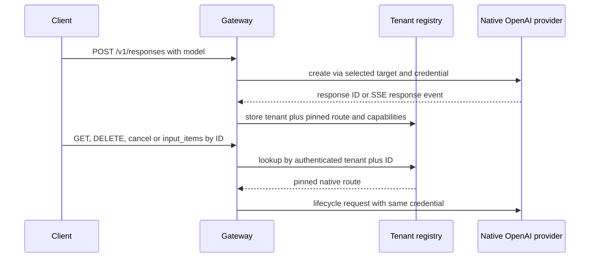
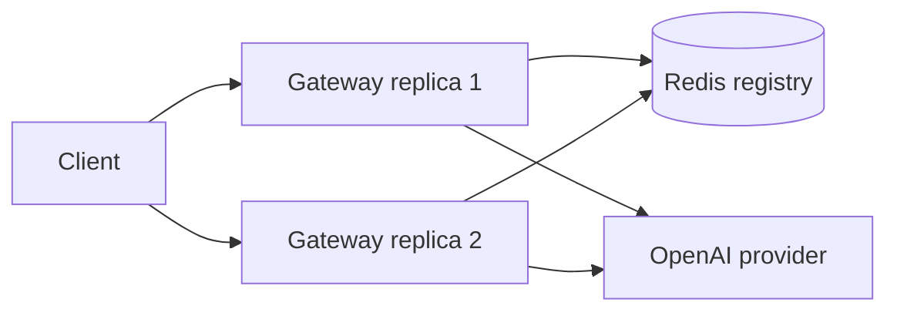

# Routing OpenAI Responses resources through a tenant-scoped registry

**Status:** Development · **Date:** 13 Jul 2026 · **Issues:** [ROL-252](https://linear.app/rolter/issue/ROL-252), [ROL-264](https://linear.app/rolter/issue/ROL-264)

## Context

ROL-252 added OpenAI Responses creation, routed on the `model` field. ROL-264 adds `GET` and `DELETE /v1/responses/{id}`, `POST /v1/responses/{id}/cancel` and `GET /v1/responses/{id}/input_items`. These requests carry no model, tenant or provider, and the upstream identifier cannot safely be used to re-balance: the request could go to a different provider, target or provider key and expose another tenant's resource.

The gateway already authenticates the virtual key, atomically refreshes the routing snapshot and selects a concrete provider credential. A safe lifecycle requires remembering that decision after a successful `POST /v1/responses`, streaming responses included. Translated Chat Completions and Anthropic Messages do not create a persistent upstream Responses resource.

## Options considered

### Option 1 — Re-select the route from the response ID

Hash `response_id` and use the current balancer or iterate over providers.

### Option 2 — Bounded process-local tenant registry

After a successful creation, store the composite key `virtual-key digest + response_id` and pin it to the provider, target, model and provider-credential fingerprint. The entry has a TTL and is removed after a successful DELETE.

### Option 3 — Distributed registry in Redis

Store the same entries in shared Redis with a TTL, so that any gateway replica can serve a lifecycle request.

## Comparison

| Option | Pros | Cons |
|--------|------|------|
| **1. Re-selection** | No new state | Tenant isolation, provider and credential cannot be guaranteed; unsafe |
| **2. Process-local registry** | Adds no network hop and no mandatory infrastructure to the data plane; the synchronous write is available as soon as the response completes | Requires sticky routing between replicas; entries are lost on restart |
| **3. Redis registry** | Works across replicas and survives a gateway restart | Redis becomes mandatory for lifecycle; adds latency, a failure mode and a write race after SSE completion |

## Decision

Option 2 was chosen. `rolter-gateway` keeps a bounded process-local registry. The key is composed of a peppered digest of the virtual key and the public `response_id`; the plaintext key is not stored. The value records the provider, target, public model, provider-native ID, the fingerprint of the selected provider credential and capability flags.

By default an entry lives for 24 hours and a single process holds at most 100,000 entries. Both are configured through `[responses] registry_ttl_secs` and `registry_max_entries`; a zero value disables registration. Expiry and overflow are cleaned up lazily on lookup/insert. A successful DELETE removes the entry immediately.

## Rationale

A process-local registry closes the main security invariant without requiring Redis on the inference path. The composite key makes unknown, expired and cross-tenant lookups indistinguishable. Pinning to the provider credential prevents reaching the resource through a different upstream account. The fingerprint makes it possible to find the same credential after the key pool is reordered, without storing the secret a second time.

Translated Chat Completions and Anthropic Messages get an entry with empty lifecycle capabilities. That allows returning a precise `501 response_lifecycle_unsupported` to the owner while keeping a uniform `404 response_not_found` for any other tenant.

## Consequences

**Benefits:**

- a lifecycle request is never re-balanced and always uses the original provider account;
- unknown, expired, deleted, cross-tenant and post-config-change unreachable resources all return the same `404` with no route metadata;
- the native upstream status and body are forwarded without translation;
- non-streaming JSON and completed SSE are registered from a single completion-observer point.

**Drawbacks and risks:**

- multi-replica deployments require sticky routing by client or response ID;
- a gateway restart drops the registry earlier than upstream retention;
- the full response is temporarily buffered by the existing accounting stream; the registry reuses that buffer, but the memory footprint is not reduced;
- deleting a provider, changing its kind or rotating the original credential makes the entry unreachable and returns `404`.

**System impact:**

`rolter-core` (retention configuration), `rolter-gateway` (registry, lifecycle handlers and response observer), `rolter-proxy` (model-less forwarding), the OpenAPI spec, the API documentation and the engine smoke suite change. The Postgres/Redis schemas do not.

## Related records

- ADR-0005 — Org → Team → Project → Virtual Key tenancy
- ADR-0014 — Extensible API protocol translation
- ADR-0015 — OpenAI Responses API translation
- ROL-252 — OpenAI Responses API passthrough and streaming
- ROL-264 — Responses API lifecycle resources

## Open questions

- Add an optional Redis registry backend if lifecycle must work without sticky routing across replicas.
- Extend capability discovery once OpenAI-compatible providers reliably implement the native Responses lifecycle.
