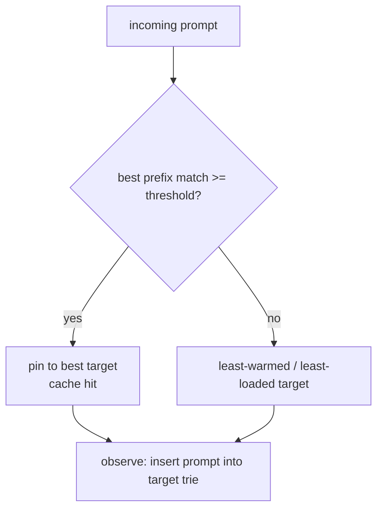

# Caching

rolter deals with two distinct kinds of caching.

## 1. KV-cache affinity (load balancing)

The big win for self-hosted fleets: vLLM/SGLang reuse the attention KV cache for shared prompt prefixes (system prompts, few-shot examples, conversation history). But that only helps if the next matching request lands on the **same** replica. Naive round-robin scatters related requests and destroys cache locality.

The `cache_aware` strategy keeps, per target, a byte **trie** of prompts it has served. For an incoming prompt it computes the fraction of leading bytes already present on each target and:

- if the best match ≥ `threshold` (default `0.5`), pins the request to that target (cache hit)
- otherwise spreads to the least-warmed target (or least loaded once load is wired)

This is **approximate** (no coupling to the engine). The per-target trie is capped at a node ceiling (default 1M nodes) with **LRU eviction**: inserting past the cap drops the least-recently-inserted prompt, pruning only the nodes that become unreferenced (shared prefixes survive). Each trie exposes an eviction counter for observability.



### Precise vLLM mode

Set a provider's `[providers.kv_events]` block and choose `strategy = "precise_cache_aware"`. rolter supports the vLLM V1 msgpack `KVEventBatch` protocol documented for vLLM 0.22: a three-frame ZMQ publication (`topic`, big-endian sequence, payload) containing tagged `BlockStored`, `BlockRemoved`, and `AllBlocksCleared` events. `BlockStored.token_ids` and `block_size` derive stable local prefix identities; external block hashes allow exact removals. State is capped by `max_blocks` per provider.

Exact scoring needs the token ids produced by the same tokenizer as vLLM. Send them in `x-rolter-vllm-token-ids` as comma-separated unsigned integers. Without the header, with stale/malformed events, or after a sequence gap, the scorer is neutral and least-load routing takes over. A sequence gap clears the local index and precise scoring remains disabled until an `AllBlocksCleared` event establishes a clean boundary.

```toml
[[providers]]
name = "vllm-a"
kind = "openai_compatible"
api_base = "http://vllm-a:8000"

[providers.kv_events]
endpoint = "tcp://vllm-a:5557"
topic = "kv-events"
max_blocks = 1000000
stale_secs = 30
```

vLLM must enable KV events with the ZMQ publisher and matching topic. Metrics expose consumed/malformed events, stream failures, decision count, and per-provider freshness.

### LMCache-aware mode

Set `[providers.lmcache]` and use `strategy = "lmcache_aware"`. The supported controller signal is an HTTP `200` JSON object:

```json
{"occupancy": 0.42, "cache_available": true}
```

`occupancy` is clamped to `[0,1]`; available targets score `1 - occupancy`, unavailable targets score zero. Polling happens in the background. Failed, malformed, or stale signals are neutral, so existing least-load routing continues.

```toml
[providers.lmcache]
endpoint = "http://lmcache-a:9000/v1/occupancy"
refresh_secs = 2
stale_secs = 10
```

## 2. Response cache

Optional caching of full responses to cut cost/latency for repeated requests:

- **exact**: hash of the normalized request → cached response (Redis), short TTL, opt-in per route/key.
- **semantic**: after an exact miss, embed the normalized conversation text through a configured provider and compare cosine similarity against a bounded recent-entry window in Redis. The route controls the threshold and candidate cap. Embedding, Redis, and decode failures fail open to normal routing. Only compatible requests are ever compared — see [Semantic compatibility](#semantic-compatibility).

Streaming responses are cached on completion and replayed as a synthetic stream. Cache status is surfaced via response headers (e.g. `x-rolter-cache: hit|miss`).

```toml
[cache]
enabled = true

[routes.cache]
enabled = true

[routes.cache.semantic]
provider = "openai"
model = "text-embedding-3-small"
threshold = 0.92
max_candidates = 256
```

### Semantic compatibility

A semantic hit replays a reply produced for a _different_ request, so similar wording is not enough on its own: two requests can read alike and still expect incompatible replies (#1476). `crates/rolter-gateway/src/semantic.rs` splits every request into two parts before any similarity is computed:

- the **text** that is embedded: the `user` and `assistant` turns (with an OpenAI `name`), or the `prompt` of a legacy completion;
- a **partition**: a sha-256 over the canonical, key-sorted form of _every other field_ of the post-injection body, including `stream`, `stream_options`, `tools`, `tool_choice`, `response_format`, sampling and length parameters, the model, and the dialect. OpenAI `system`/`developer` messages (with their position) and the Anthropic top-level `system` are partition fields too, so instructions are matched exactly rather than by similarity. `"Answer in German"` and `"Answer in Japanese"` embed almost identically, so this is the only safe way to compare them.

The partition is part of the Redis index key, so the candidate scan never sees an entry from another partition. It is an allowlist of what may vary, not a list of what must match. Only the conversation text, `user` and `metadata` are left out (attribution that does not change the reply), and `stream: false` is folded into an absent `stream`. A field the gateway does not know splits the cache, which costs hit rate but never correctness. As a last check before replay, a hit whose stored content type disagrees with the caller's `stream` flag is treated as a miss.

Requests whose meaning the text would not capture **bypass semantic lookup** before the embedding call, and so cost no embedding spend. They still use the exact cache.

| Shape                                                                                                   | Semantic lookup |
| ------------------------------------------------------------------------------------------------------- | --------------- |
| `/v1/chat/completions` with text-only `system`/`developer`/`user`/`assistant` turns                     | yes             |
| `/v1/messages` with text-only `user`/`assistant` turns and a text `system`                              | yes             |
| `/v1/completions` with a single string `prompt`                                                         | yes             |
| any non-text content part (images, audio, files, documents)                                             | bypassed        |
| tool traffic inside the conversation (`tool_calls`, `tool` turns, `tool_use`/`tool_result` blocks)      | bypassed        |
| a batch or token-id `prompt`, or a turn carrying any key other than `role`, `content` and `name`        | bypassed        |
| `/v1/embeddings`, `/v1/audio/*`, `/v1/images/*`, `/v1/rerank` (the output must match the input exactly) | bypassed        |
| `/v1/responses` (not response-cached at all)                                                            | bypassed        |

Offering tools in the request (`tools`, `tool_choice`) is supported. The schema is a partition field, so a reply is only replayed to a request that offered exactly the same tools.

The index key carries a layout version (`<namespace>:semantic:v2`). Entries written before #1476 had no partition and live under the old `<namespace>:semantic` key, so after an upgrade they are never read again and expire on their TTL. Bump `SEMANTIC_LAYOUT_VERSION` whenever the partition rules change.

The HTTP regression suite is `crates/rolter-gateway/src/semantic/http_tests.rs`. It serves the gateway in-process against a stub upstream whose embeddings are identical for every input, with the in-memory cache backend (`ResponseCache::in_memory`, test builds only), so it needs neither Redis nor a paid model. Because similarity alone would match any two requests there, each miss it asserts is the partition or the bypass at work, and each hit shows the partition does not over-split.
