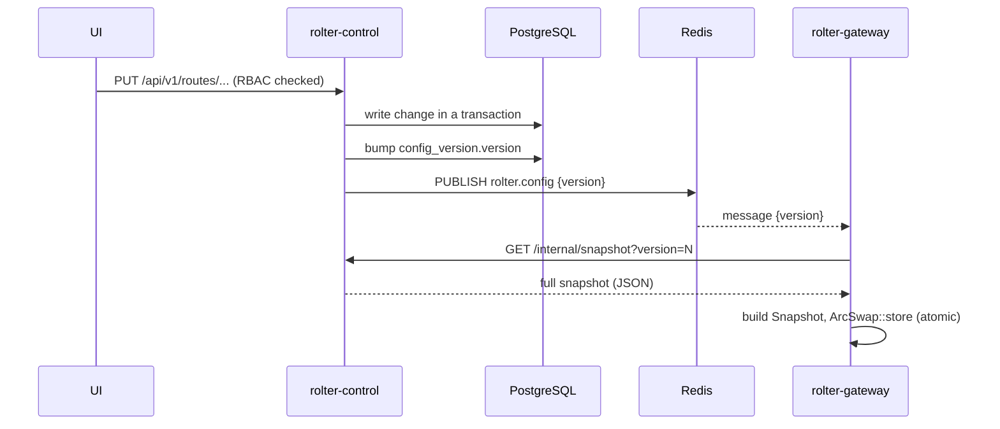

# Configuration & hot reload

A core requirement: operators change routes, providers, keys, limits and pricing from the UI and have them take effect **without restarting** the gateway.

## Sources of config

1. **Bootstrap file** (`rolter.toml`) — used for first run, local dev, and IaC. Maps to `rolter_core::GatewayConfig`.
2. **Database (Postgres)** — the runtime source of truth once the control plane is running. The control plane composes a `GatewayConfig`-equivalent snapshot from normalized tables.

## Propagation

- The gateway keeps the routing table in an `ArcSwap<Snapshot>`. Swapping is atomic and wait-free for readers — in-flight requests keep using the old snapshot; new requests see the new one.
- **Versioning**: `config_version` in Postgres is the monotonic source of truth. The gateway also reconciles on an interval (and at startup) so a missed pub/sub message self-heals.
- **Validation**: the control plane validates a snapshot (every route target references a known provider, etc.) before bumping the version, so gateways never load a broken config.
- **Per-row resilience**: validation used to be all-or-nothing, so a single half-built row 500'd `/internal/snapshot` and froze config propagation for *every* tenant. Rows that are unservable only by themselves are now **omitted from the snapshot** instead. That covers both a route with no usable target (created before its targets are added, or pointing at a deleted provider) and a **provider whose own definition is invalid** — a malformed `api_base`, a hosted adapter missing its `api_key_env`. Dropping a provider drops the routes that depended on it, since they are then left with no resolvable target. Structural problems that span rows (duplicate names, a bad `metrics_path`, unreadable CA bundles) still fail the whole snapshot, since silently dropping one of two colliding rows would be worse than refusing.
- **Saying what was dropped** (#926): omitting an entry quietly is its own failure mode — every gateway keeps serving its last good config, so nothing looks broken until a gateway restarts cold or someone wonders why a change never took effect. So the reasons travel with the config:
  - `/internal/snapshot` carries a `problems: [...]` array alongside `version` and `config`, present only when something was dropped. It is absent from a healthy snapshot, which is what every gateway in the fleet transfers on every poll.
  - the gateway logs them **once per change**, at the point it applies a new version, rather than once per poll — a fleet polling every 5s would otherwise repeat the same complaint thousands of times a day. An older control plane sends no such field, so it defaults rather than failing the decode during a rollout.
  - the dashboard reads `GET /api/v1/config/problems` and shows them on the Providers screen. That endpoint runs the same computation the snapshot does, so the two cannot disagree; it also reports structural problems, which never reach a gateway at all.
- `GET /api/v1/config` is the dashboard's read-only view of the same document and sits on the open router, so it answers without a session. It is therefore **redacted before it leaves the control plane** (`redact_config_for_dashboard`): provider credentials, the plaintext of `[[virtual_keys]]`, the digests of database keys and every MCP OAuth session are removed, and userinfo is stripped from the ClickHouse and egress-proxy URLs. Anything a gateway needs to authenticate with comes only through the token-guarded `/internal/snapshot` (#1212).

## Why this design

- Redis pub/sub gives near-instant fan-out to many gateway replicas.
- Postgres versioning makes the system correct even if Redis drops a message.
- `ArcSwap` keeps the hot path lock-free; no read ever blocks on a config write.

Alternatives considered: Postgres `LISTEN/NOTIFY` (avoids a Redis dependency but Redis is already needed for cache/rate limits), and pure polling (simplest, higher latency). See [ADR](../adr/README.md).
