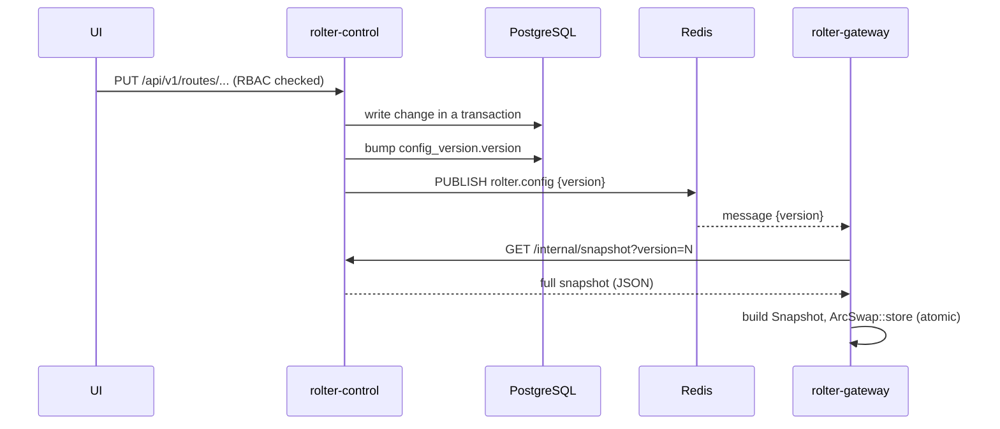

# Configuration & hot reload

A core requirement: operators change routes, providers, keys, limits and pricing from the UI and have them take effect **without restarting** the gateway.

## Sources of config

1. **Bootstrap file** (`rolter.toml`) — used for first run, local dev, and IaC. Maps to `rolter_core::GatewayConfig`.
2. **Database (Postgres)** — the runtime source of truth once the control plane is running. The control plane composes a `GatewayConfig`-equivalent snapshot from normalized tables.

### Bootstrap file plus database (merged mode)

`rolter control --config rolter.toml --database-url ...` (which `rolter easy-up` also runs) wraps the Postgres store in `MergedConfigStore`: `load()` starts from the file and decides, table by table, which side the snapshot takes. Without `--config` the pure `PostgresConfigStore` projects every store-owned table and the file does not exist. The owner per `GatewayConfig` field in merged mode:

| Fields                                                                                                                                                                            | Owner in merged mode                                                                                                                                                                                                                         |
| --------------------------------------------------------------------------------------------------------------------------------------------------------------------------------- | -------------------------------------------------------------------------------------------------------------------------------------------------------------------------------------------------------------------------------------------- |
| `providers`, `routes`, `provider_groups`, `virtual_keys` / `db_virtual_keys`, `model_prices`, `budgets`, `rate_limits`                                                            | both: the file's rows win a name collision and the store's rows extend them; the CRUD API refuses to edit a file provider, route or group (ADR-0022)                                                                                         |
| `guardrails`, `guardrail_webhook`                                                                                                                                                 | both: file rules win a name collision, registry rules extend them; an enabled file webhook wins, else the registry's                                                                                                                         |
| `mcp_servers`, `mcp_oauth_sessions`, `feature_flags`                                                                                                                              | the store only (the flags are control-plane gates, and a file that sets one is ignored)                                                                                                                                                      |
| `retry`, `timeouts`, `queue`, `compatibility`, `adaptive_routing`                                                                                                                 | the store, **unless it still holds its seeded defaults**, in which case the file's value stands (#2931)                                                                                                                                      |
| `client`, `security`, `model_defaults` (Client Settings, Security, Model Settings)                                                                                                | the store, **unless it still holds its seeded defaults**, in which case the file's value stands (#2922)                                                                                                                                      |
| `logging`                                                                                                                                                                         | field by field: the store's `sample_rate`, `payload_capture` and `ui_events`, under the same rule (#2931); the file's `clickhouse_url`, `batch_max`, `flush_ms` and `queue_capacity` always, since `logging_settings` has no column for them |
| `prompt_templates`, `plugins`                                                                                                                                                     | both: every stored template and enabled plugin is served, and a file entry survives unless the store has the same one (#2922)                                                                                                                |
| `server`, `tls`, `currency`, `unpriced_policy`, `cooldown`, `cache`, `responses`, `health`, `breaker`, `metrics_scrape`, `realtime`, `usage_recording`, `egress`, `pii_sanitizer` | the file; no store table exists for them (`cache.enabled`, `health.enabled` and `breaker.enabled` follow their feature flag)                                                                                                                 |
| `models`, `provider_defaults`, `provider_group_defaults`                                                                                                                          | the file, as seed input only: `rolter-seed --import` and the control plane's startup seeding copy them into the store                                                                                                                        |

Before #2922 `client`, `security`, `model_defaults`, `prompt_templates` and `plugins` were in the file row: what an admin saved on those screens was stored and bumped `config_version`, but the snapshot kept carrying the file's value, so no gateway ever saw it. Before #2931 the other singletons went the opposite way: `retry`, `timeouts`, `queue`, `compatibility`, `adaptive_routing` and `logging` were copied from the store unconditionally, so a store nobody had written replaced the file's value with its defaults, and the file's `clickhouse_url` and batching with them.

The "never written" rule exists because the singleton tables are seeded by their migration, so a store nobody has saved projects exactly `Default::default()` and is indistinguishable from an admin who saved the defaults. Treating that state as "the store has an opinion" would turn a `[security] required_headers` in an existing file into "no rules" on upgrade, so the file's value is used while the store equals the default and the store's value wins outright once it differs (the whole screen, not field by field). The one corner it cannot tell apart is an admin saving the defaults back over a differing file value: the file's value applies again, and is cleared by editing the file. `merged_store_a_migrated_store_projects_the_defaults_of_the_settings_it_owns` pins the premise against a migrated schema.

Prompt templates and plugins have no `ConfigOwned` guard in the CRUD API, so a file entry is not read-only in the dashboard. The store therefore wins a collision here, the reverse of providers: a file entry that won would silently shadow a version an admin published. A stored template's id is `{org_id}:{slug}` and a file template's is the bare id, so they are matched on the slug; `rolter-seed --import` copies a file template into the store under the slug the file names it by, which is what keeps the imported copy and the file's from both running on one request. Plugins are matched on `(org_id, project_id, slug)`. A store with no published template leaves the `[prompt_templates]` block exactly as the file wrote it, and a file block with `enabled = false` contributes no templates beside the store's.

## Propagation

```mermaid
sequenceDiagram
  participant UI
  participant Control as rolter-control
  participant PG as PostgreSQL
  participant Redis
  participant GW as rolter-gateway
  UI->>Control: PUT /api/v1/routes/... (RBAC checked)
  Control->>PG: write change in a transaction
  Control->>PG: bump config_version.version
  Control->>Redis: PUBLISH rolter.config {version}
  Redis-->>GW: message {version}
  GW->>Control: GET /internal/snapshot?version=N
  Control-->>GW: full snapshot (JSON)
  GW->>GW: build Snapshot, ArcSwap::store (atomic)
```

- The gateway keeps the routing table in an `ArcSwap<Snapshot>`. Swapping is atomic and wait-free for readers — in-flight requests keep using the old snapshot; new requests see the new one.
- **Versioning**: `config_version` in Postgres is the monotonic source of truth. The gateway also reconciles on an interval (and at startup) so a missed pub/sub message self-heals.
- **Validation**: the control plane validates a snapshot (every route target references a known provider, etc.) before bumping the version, so gateways never load a broken config.
- **Per-row resilience**: validation used to be all-or-nothing, so a single half-built row 500'd `/internal/snapshot` and froze config propagation for _every_ tenant. Rows that are unservable only by themselves are now **omitted from the snapshot** instead. That covers both a route with no usable target (created before its targets are added, or pointing at a deleted provider) and a **provider whose own definition is invalid** — a malformed `api_base`, a hosted adapter missing its `api_key_env`. Dropping a provider drops the routes that depended on it, since they are then left with no resolvable target. **Prompt templates** are pruned the same way (#2279): each published `(id, version)` is validated on its own through `PromptTemplatesConfig::template_problems`, which runs the same `validate` the whole config does over a one-template config, and an invalid one is omitted with a problems entry naming it and the reasons. Nothing references a template from outside it (scopes live on the template), so the prune leaves no dangling reference. The first line of defence is the control plane: `POST .../versions` and publish/rollback refuse, with a 400 listing the problems, content that check would reject, so the prune only has to cover rows written before that check or by other paths (seed, import, SQL). A route's `advanced.guardrails` `disable`/`enable` entry that names a guardrail rule no enabled row carries is **pruned from that route** with a problem line (#2306): the store loads only enabled rows, so pausing, renaming or deleting a dashboard rule would otherwise strand every override naming it and 500 the snapshot. Pruning is safe both ways — an `enable` for a missing rule has nothing to enable and a `disable` for a rule that is not running has nothing to switch off. Only the snapshot path prunes; `validate` still rejects an unknown name in a file config, where it is a typo and a typo in `disable` must not read as "this rule is off here". The problem text does not tell a paused rule from a never-defined one. A route's `advanced.headers` entry that the wire cannot carry, or that names a credential or a framing header, is pruned the same way (#2924): `AdvancedModelConfig::drop_unsendable_headers` removes just that header and the route keeps serving, `validate` still rejects it in a file config, and the control plane refuses it on write. See [Route advanced settings](route-advanced-settings.md). A **model price** with a negative rate is pruned the same way (#2889), since priced as written it would turn a request into a credit against its budget and repairing it to zero would make the model free: the row is omitted with a problem line and the model is unpriced, which `unpriced_policy` already answers. `ModelPriceConfig::rate_problems` is the check; `validate` runs it too, so a file config with a negative rate is refused. A rate Postgres can hold but a `Decimal` cannot (`NaN`) never reaches the config at all: the store's loader leaves that price out and logs it, and `load_problems` reports it. Structural problems that span rows (duplicate names, a bad `metrics_path`, unreadable CA bundles) still fail the whole snapshot, since silently dropping one of two colliding rows would be worse than refusing.
- **Saying what was dropped** (#926): omitting an entry quietly is its own failure mode — every gateway keeps serving its last good config, so nothing looks broken until a gateway restarts cold or someone wonders why a change never took effect. So the reasons travel with the config:
  - `/internal/snapshot` carries a `problems: [...]` array alongside `version` and `config`, present only when something was dropped. It is absent from a healthy snapshot, which is what every gateway in the fleet transfers on every poll.
  - the gateway logs them **once per change**, at the point it applies a new version, rather than once per poll — a fleet polling every 5s would otherwise repeat the same complaint thousands of times a day. An older control plane sends no such field, so it defaults rather than failing the decode during a rollout.
  - the dashboard reads `GET /api/v1/config/problems` and shows them on the Providers screen. That endpoint runs the same computation the snapshot does, so the two cannot disagree; it also reports structural problems, which never reach a gateway at all.
  - that endpoint also appends `ConfigStore::load_problems`: rows the store's loader could only map onto the config by guessing, such as a budget whose stored `period` it does not recognise and enforces as monthly (#1902). The snapshot carries the guess rather than the row, so only the store can say where one was made. Those lines are not in the snapshot's `problems`, because nothing was dropped: the gateway serves the row, just not as the row says.
- `GET /api/v1/config` is the dashboard's read-only view of the same document. It needs a session of any role (or the admin token, or open mode; #1840), and is still **redacted before it leaves the control plane** (`redact_config_for_dashboard`): provider credentials, the plaintext of `[[virtual_keys]]`, the digests of database keys and every MCP OAuth session are removed, and userinfo is stripped from the ClickHouse and egress-proxy URLs. Anything a gateway needs to authenticate with comes only through the token-guarded `/internal/snapshot` (#1212).

## Why this design

- Redis pub/sub gives near-instant fan-out to many gateway replicas.
- Postgres versioning makes the system correct even if Redis drops a message.
- `ArcSwap` keeps the hot path lock-free; no read ever blocks on a config write.

Alternatives considered: Postgres `LISTEN/NOTIFY` (avoids a Redis dependency but Redis is already needed for cache/rate limits), and pure polling (simplest, higher latency). See [ADR](../adr/README.md).
