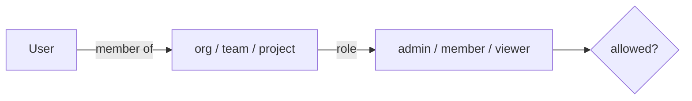
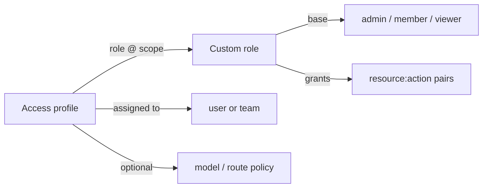

# RBAC & authentication

Two distinct auth surfaces:

## 1. Gateway (data plane) — virtual keys

Clients call `/v1/*` with a **virtual key** (`Authorization: Bearer <key>` or `x-api-key`). The gateway:

- looks the key up in the current snapshot
- checks the key is neither disabled nor past its `expires_at`
- checks the key's model allow-list (empty = all)
- once the model resolves to a route, applies the route authorization contract below
- (roadmap) enforces budgets and RPM/TPM limits for the key's scope chain

Keys are stored as hashes; the presented key is compared in constant time (`rolter_auth::verify_key`).

### The route authorization contract (#1485)

Access to a route must not depend on how the request body is encoded. Every
data-plane endpoint that addresses a model therefore authorizes through the
same two functions in `crates/rolter-gateway/src/handlers.rs`, and no endpoint
re-implements a check inline:

| Gate              | Runs                                                                    | Refuses with                          |
| ----------------- | ----------------------------------------------------------------------- | ------------------------------------- |
| `authorize_model` | on the requested model id, before budgets, plugins and rate limits      | `403 model_not_allowed`               |
| `authorize_route` | on the resolved route (named or `provider-slug/model`), before upstream | `403` with the code of the first gate |

`authorize_route` checks, in order:

1. **visibility** — `advanced.visibility.allowed_team_ids` / `allowed_key_ids`
   (`model_visible_to`); refused as `model_not_allowed`. It runs first so a
   hidden route never reveals whether the other gates would also have refused.
   A request with no key at all is refused by any non-empty visibility list.
2. **route policy** — the access-profile policy of the key's creator
   (`KeyMeta::route_permitted`, #791); refused as `route_not_allowed`.
3. **provider allow-list** — at least one target on the route (classic pool or
   any variant) is a provider the key may use (`key_allows_route`); refused as
   `provider_not_allowed`.

The per-target provider filter in `pick_untried` still runs during balancing;
the route gate only guarantees that at least one target is reachable, so the
caller gets an explicit `403` rather than a failed target selection.

The callers are the JSON pipeline (`proxy`: chat, completions, responses,
messages, embeddings, rerank, image generation, audio speech), the multipart
pipeline (`proxy_multipart`: audio transcriptions and translations) and the
Realtime upgrade (`realtime::realtime`), which refuses before the WebSocket
handshake completes and before an upstream socket is dialled. The complexity
tier selector and `GET /v1/models` use the same `authorize_route`, so a tier
never upgrades a request onto a route its key could not address directly, and
the listing only shows routes the key could call. Before #1485 the multipart
path checked only the model allow-list and the Realtime upgrade skipped
visibility, so a hidden or policy-denied route was reachable through an audio
upload or a socket. The HTTP regressions for every gate on every pipeline live
in `crates/rolter-gateway/tests/integration.rs` (`audio_uploads_*`,
`realtime_upgrade_enforces_route_visibility`).

`visibility.allowed_user_ids` and `visibility.minimum_role` are not enforced on
the data plane: a virtual key carries no user identity or role. They remain
control-plane concerns.

The Responses lifecycle calls (`GET`/`DELETE /v1/responses/{id}`, `POST
/v1/responses/{id}/cancel`, `GET /v1/responses/{id}/input_items`) address a
stored response rather than a model, so they carry no route to resolve. The
registry entry records both the model the caller named and the route that
served it (`ResponseRoute::route`: the configured route name, the tier route a
complexity policy moved the request onto, or the `provider-slug/model` address
itself). `authorize_lifecycle` re-runs the contract against the **current**
snapshot on every call (#1779):

1. `authorize_model` on the recorded model id
2. the recorded route is resolved as the request path would resolve it (named
   route first, then `provider-slug/model` addressing), and `authorize_route`
   runs on it
3. the key must still allow the one provider holding the response; refused as
   `provider_not_allowed`, since the call can only go to that provider

It runs after the tenant-scoped registry lookup, so another key still gets the
uniform `404 response_not_found` and learns nothing; only the response's owner
can see these `403`s. Without it, access revoked after creation (visibility,
route policy, a narrowed key) would keep working for the registry TTL, which is
24 hours by default.

**A removed route fails closed.** When the recorded route no longer resolves,
the call is refused with `403 route_not_allowed` ("no longer configured"). With
the route gone there is nothing left to evaluate visibility and route policy
against. Allowing the call would let a deleted route keep serving
provider-credentialed calls until the entry expires, and deleting a route is
often exactly how an operator withdraws access. The cost is that a response
created on a route that was then renamed or removed can no longer be managed
through the gateway; recreating the route restores access. HTTP regressions:
`response_lifecycle_rechecks_route_authorization_after_revocation` and
`response_lifecycle_reauthorizes_pinned_addresses`.

A new endpoint that resolves a route must call both gates. Budgets, rate limits
and metering for Realtime sessions are tracked separately in #1396.

### Empty key sets

An empty effective key set does **not** mean "auth disabled" on a managed
deployment. A gateway started with `--snapshot-url` (its config comes from the
control plane) **fails closed**: with no virtual keys in the snapshot every
`/v1/*` request gets `401`. This keeps revoking the last key a lock-down rather
than an accidental opening of the whole data plane.

A gateway running from a static bootstrap config with no keys stays keyless, so
local `fake-llm` development needs no setup.

### Key lifetime (#945)

`virtual_keys.expires_at` has always been read by the data plane —
`KeyMeta::is_valid` refuses a key at or after that instant — but until #945 the
mint path never wrote a value, so every key created through the dashboard or
the API was immortal. The mint request now carries `expires_in_days` and the
**control plane** turns it into an instant, rather than accepting one from the
caller: a client with a wrong clock cannot mint a key that outlives what the
operator chose. Omitting the field is the only way to ask for a key that never
expires, and `0` is refused because it reads as "no expiry" while meaning
"already expired".

The same request requires a non-blank `name`. The plaintext secret is returned
exactly once, so an unnamed key cannot be told apart from its siblings
afterwards; the rule is enforced in the API, not only in the form, and applies
equally to the admin (`/api/v1/projects/{id}/virtual-keys`) and self-service
(`/api/v1/me/projects/{id}/virtual-keys`) paths.

Rotation replaces a secret without renewing the decision: the fresh key inherits
the old one's `expires_at`, and its `purpose`.

### The playground key is scoped by the server

`POST /api/v1/me/projects/{id}/playground-key` mints a key for the dashboard's
own Playground, and it deliberately takes **no request body** (#1640). Both of
the things a body would carry are the reasons this endpoint exists:

- **Reach.** The mint paths above take `models` from the caller, which is right
  for a key an operator is configuring and wrong for this one: a key the client
  scopes cannot be a key that "cannot address a model the user could not already
  address", because the client can ask for everything. The list is computed here
  from the routes configured in the project being minted against, and written
  out explicitly — an empty `models` array means _every_ model, so a project with
  no routes is a `400` rather than a key with the widest possible reach.
- **Lifetime.** `expires_in_days` has a floor of one day. A playground key lives
  `PLAYGROUND_KEY_TTL_MINUTES` (30) and the dashboard asks for a fresh one, so a
  credential does not outlive the tab holding it.

The row carries `purpose = 'playground'` so the Keys screen can say what it is
rather than leaving a reader to infer it from a short expiry. The list is
resolved once, at mint time: a route added afterwards is outside that key's
reach, which makes it a snapshot of what the caller could reach rather than a
standing grant.

The dashboard calls this once per project as the Playground opens, and once
more per **Renew key** — never in a loop, since a refusal (a routeless project
answers `400`, no session answers `401`) is a state the operator has to act on
rather than one a retry can clear. Both the Virtual Keys screen and the account's
own key list label a `purpose = 'playground'` row, so a half-hour expiry reads as
the design rather than as somebody's mistake.

Override either default with `server.require_auth`:

| value           | behaviour on an empty key set               |
| --------------- | ------------------------------------------- |
| `true`          | always deny (`401`)                         |
| `false`         | always allow the keyless path               |
| unset (default) | managed → deny, static local config → allow |

## 2. Control plane (dashboard) — users + roles

Human users authenticate to the control plane. Two providers ship today: **local accounts** (argon2id password hashes, `rolter_control::auth`) and **OAuth2/OIDC SSO** (`rolter_control::sso`, authorization-code flow with PKCE, JWKS-verified id tokens, IdP group → role mapping). RBAC roles:

- **admin** — full control within scope (manage providers, routes, keys, members, budgets)
- **member** — create/edit routes and keys within scope
- **viewer** — read-only (dashboards, logs)

Roles are granted via `memberships` at an **org / team / project** scope. Permission checks resolve the most specific membership for the target resource.



### The capability table is the only source of truth

`CAPABILITIES` in `crates/rolter-control/src/rbac_matrix.rs` records, for every resource, what each of `read` / `create` / `update` / `delete` takes — a minimum scoped role, superadmin-only, or that the resource has no such action at all. **Both** the published matrix and the guard read it, so they cannot drift.

A guarded handler names a `(resource, action)` pair instead of a role:

```rust
authorize(&state, &principal, ScopeChain::org(org_id), cap!("provider", Create)).await?;
// deployment-wide, no scope to hold a role in:
authorize_superadmin(&principal, superadmin_cap!("feature_flags", Update))?;
```

`cap!` resolves the requirement through a `const fn`, so naming a resource the table does not define — or an action it marks as unsupported — is a **compile error**, and `superadmin_cap!` additionally fails to compile unless the table says the pair is superadmin-only. No handler names a `Role`; unit tests in `rbac_matrix.rs` scan every control-plane module to keep it that way, check the module list against `src/` so a new file cannot slip past, and assert that every row in the table is claimed by at least one guard.

Two read-only endpoints publish that table, so a dashboard never assembles a permission matrix of its own:

- `GET /api/v1/rbac/matrix` — every role and, per resource, the minimum role each action takes (or that the action is superadmin-only, or unsupported entirely). Any authenticated caller may read it; it describes rules, not anyone's access.
- `GET /api/v1/rbac/effective?org_id=&team_id=&project_id=` — the calling principal's resolved role at that scope chain and the concrete `resource:action` pairs they may perform, evaluated from their memberships.

`effective` is advisory to the client and authoritative only on the server: a caller that ignores it and issues the request anyway gets the same `403`. Scope precedence is unchanged — a project-scoped grant authorizes that project, not the whole org.

Read access is a viewer's and mutations are an admin's, with three deliberate exceptions:

- **deployment-wide policy** (feature flags, runtime/compatibility/adaptive policy, logging settings, cluster nodes, security settings, alerting, MCP tool-call logs) has no tenancy scope to be a member of, so it is superadmin-only;
- **global account lifecycle** — creating an org, editing or deleting a user account, and the model/pricing catalog — reaches across orgs, so it is superadmin-only too, while inviting a user _into_ an org stays an org admin's;
- **a user's own things** — minting a virtual key for yourself takes `member` (a viewer cannot), and revoking your own MCP OAuth grant or session takes only a viewer membership plus ownership, which the handler checks after the guard.

Listing the pricing catalog (`GET /api/v1/model-prices`) and the effective model list (`GET /api/v1/models`) is every **authenticated** caller's, with no membership anywhere. That is a third authority alongside a scoped role and superadmin, and the table names it rather than implying a role floor: both are deployment-wide catalogs of upstream capability and list price that carry no tenant's data, and `deployment` is not a scope a membership can be held at, so a `viewer` floor there would have described a bar nobody could clear. `GET /api/v1/rbac/matrix` reports those cells as `authenticated_only`. The effective model list is still filtered per caller by the access-profile model policy (#534), so _what_ a caller sees remains theirs alone.

Every cell in the table is now backed by the guard.

### Custom roles and access profiles

The three built-in roles are a floor, not the whole rule set. An org may define **custom roles**: a base role plus a set of explicit `(resource, action)` grants drawn from the same `CAPABILITIES` table the guard reads. A grant can only _widen_ — a custom role never takes away what its base role already allows, so the built-in roles keep behaving exactly as before and nothing has to be migrated.

Custom roles are not assigned to people directly. They are composed into an **access profile**, which names each role together with the org, team or project it applies at, and the profile is then assigned to users or teams. One profile can therefore say "auditor at the org, deploy admin on this one project" and be reused across an organization instead of re-granted per person.



Evaluation order inside `authorize` is unchanged for the common case: memberships resolve first, and the configurable half is consulted only if the built-in answer was "no". That keeps a plain deployment on exactly the old code path, and makes a custom grant strictly additive.

A profile may also carry a **model and route policy** — allow and deny lists over the models and routes its holders may reach. Deny wins over allow. Where a user holds several profiles the lists are unioned rather than intersected, since a second profile must never _reduce_ access; one consequence is load-bearing: a profile with no model restriction at all makes the merged allow-list unrestricted, because that profile already permitted everything on its own.

That policy is published on `GET /api/v1/rbac/effective` as `model_policy`, and since #791 it is also **enforced by the data plane**. The bridge is the virtual key: a policy belongs to a person, but a request carries a credential, so the control plane resolves each key owner's merged policy when it builds `/internal/snapshot` and publishes it on the key record. The gateway then applies it in `KeyMeta::model_permitted` and `KeyMeta::route_permitted`, alongside the key's own model allow-list.

Both must permit a model, deliberately. The key list is what the key's creator scoped that credential to; the policy is what an operator decided the person may reach at all. Neither can widen the other, so a key naming a model its owner is denied stays denied.

The shape, the merge rule and the allow/deny matching all live in `rolter_core::ModelPolicy`, which the control plane, the store and the gateway share — two implementations of "deny wins" free to drift apart would be a security bug.

Enforcement keys on the virtual key's `created_by`. A key with no owner — admin-created and config-defined keys — carries no policy, because there is no person whose profiles could apply; restricting those is still the key's own model list.

Because the gateway now reads them, four of these tables **do** carry a `bump_config_version()` trigger: `access_profile_policies`, `access_profile_assignments`, `access_profiles` and `memberships` (a profile assigned to a team reaches every member, so a membership change alters someone's effective policy with no profile row changing). `custom_roles` and `custom_role_grants` still do not and still must not: they decide control-plane authorization, which is evaluated per request against the live database, so there remains nothing to propagate and a trigger would only wake the fleet for a change it cannot observe. See ADR-0023 for why the policy is resolved at snapshot time rather than when a key is minted.

Changing one is safe by construction:

- deleting a custom role that a profile still references returns `409` rather than silently emptying the profile's composition; detach it first;
- deleting a profile does cascade its own assignments, since the assignment has no meaning without it;
- every create, update and delete on a role, a profile, an assignment or a policy is written to `audit_log` with the before/after, because all of them change what real people can do.

`GET /api/v1/rbac/matrix?org_id=` returns the org's custom roles alongside the built-in ones, so the dashboard's matrix is API-backed and updates after any change instead of holding state of its own.

The dashboard edits both halves (#1184). `ui/src/pages/Rbac.tsx` carries the matrix on one tab and the org's custom roles on another, with a resource x action grant grid built from the same `resources[]` the matrix returns — never a list held in the dashboard, so the grid can only offer pairs this build defines. A pair the resource does not have renders as a dash and a superadmin-only pair as a disabled checkbox, and grants naming a resource the build no longer defines ride through an edit untouched, since `PUT` replaces the grant set wholesale. `ui/src/pages/AccessProfiles.tsx` reads `GET /api/v1/access-profiles/{id}` per profile — the only call that answers roles, assignments and policy together — and sends the composition and the policy in the one request that saves the profile.

Endpoints:

- `GET`/`POST /api/v1/orgs/{org_id}/custom-roles`, `GET`/`PUT`/`DELETE /api/v1/custom-roles/{id}`
- `GET`/`POST /api/v1/orgs/{org_id}/access-profiles`, `GET`/`PUT`/`DELETE /api/v1/access-profiles/{id}`
- `GET`/`POST /api/v1/access-profiles/{id}/assignments`, `DELETE /api/v1/access-profile-assignments/{id}`
- `PUT /api/v1/access-profiles/{id}/policy`

### Identity providers (ROL-35)

Local login and SSO both end at the same place: a verified identity that gets
turned into a session and reconciled memberships. That shared shape is
`rolter_auth::IdentityProvider` — an async trait with one method,
`resolve(Credential) -> Result<Identity, IdentityError>` — so a new provider
only has to prove who someone is; everything downstream (session issuance,
group → role reconciliation, audit logging) is unchanged.

- `rolter_control::auth::LocalIdentityProvider` verifies a
  `Credential::Password`, preserving the original handler's timing-safety
  property: every rejection path (unknown account, deactivated, sso-only,
  password login disabled by org policy, wrong password) still runs exactly
  one argon2 verification, so response time reveals nothing about which case
  applied.
- `rolter_control::sso::OidcIdentityProvider` verifies a
  `Credential::AuthorizationCode`, wrapping the existing code-exchange and
  JWKS id-token verification.
- Concrete providers live in `rolter-control` (next to the `sqlx`/`reqwest`
  they need), not in `rolter-auth`, which only defines the trait and stays
  free of those dependencies.

## Roadmap

- **LDAP** — bind + group mapping for enterprise directories (#241), the next
  provider to implement `IdentityProvider`.
- **JWT** service auth and short-lived tokens.
- **Audit log** surfaced in the UI.
- Optional **constant-time map** / pepper for virtual-key lookup hardening.
