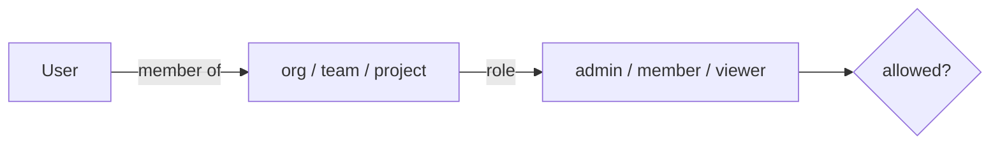
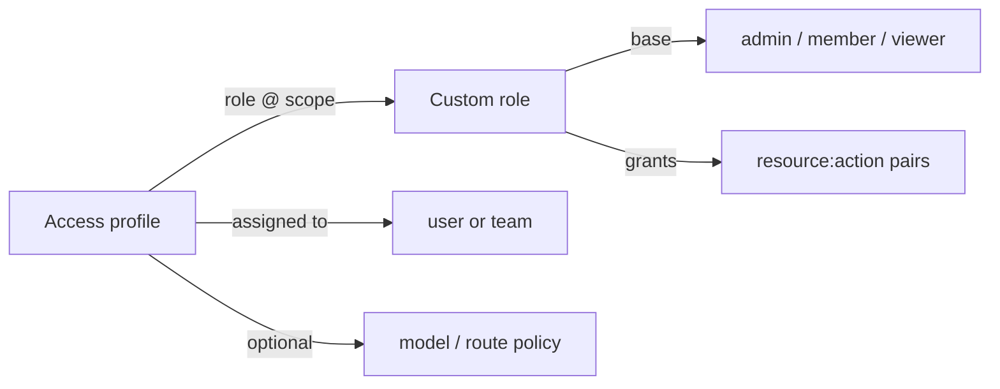

# RBAC & authentication

Two distinct auth surfaces:

## 1. Gateway (data plane) — virtual keys

Clients call `/v1/*` with a **virtual key** (`Authorization: Bearer <key>` or `x-api-key`). The gateway:

- looks the key up in the current snapshot
- checks the key is neither disabled nor past its `expires_at`
- checks the key's model allow-list (empty = all)
- once the model resolves to a route, applies the route authorization contract below
- (roadmap) enforces budgets and RPM/TPM limits for the key's scope chain

Keys are stored as hashes; the presented key is compared in constant time (`rolter_auth::verify_key`).

### The route authorization contract (#1485)

Access to a route must not depend on how the request body is encoded. Every
data-plane endpoint that addresses a model therefore authorizes through the
same two functions in `crates/rolter-gateway/src/handlers.rs`, and no endpoint
re-implements a check inline:

| Gate              | Runs                                                                    | Refuses with                          |
| ----------------- | ----------------------------------------------------------------------- | ------------------------------------- |
| `authorize_model` | on the requested model id, before budgets, plugins and rate limits      | `403 model_not_allowed`               |
| `authorize_route` | on the resolved route (named or `provider-slug/model`), before upstream | `403` with the code of the first gate |

Before either gate sees a route, resolution (`Snapshot::resolve_for`) has
already set aside every row outside the key's tenancy: a route of another org,
a route narrowed by `advanced.visibility.project_only` to a project the key was
not minted in, and a provider or group address of another org. Such a row is a
miss, so the request goes on to the builtin and the `slug/model` addresses as
if it did not exist, and ends in the `404 model_not_found` an unknown model
gets (see [One org never reaches another](#one-org-never-reaches-another-1844-1845)).

`authorize_route` checks, in order:

1. **tenancy and visibility** (`model_visible_to`); refused as
   `model_not_allowed`. It runs first so a hidden route never reveals whether
   the other gates would also have refused. The tenancy half
   (`RouteEntry::in_tenancy_of`) repeats what resolution did and only matters
   where a route was reached some other way, such as a complexity tier or a
   stored response's route; then `advanced.visibility.allowed_team_ids` /
   `allowed_key_ids` narrow the route to the teams and keys they list. A
   request with no key at all is refused by any non-empty visibility list.
2. **route policy** — the access-profile policy of the key's creator
   (`KeyMeta::route_permitted`, #791); refused as `route_not_allowed`.
3. **provider allow-list** — at least one target on the route (classic pool or
   any variant) is a provider the key may use (`key_allows_route`); refused as
   `provider_not_allowed`.

The per-target provider filter in `pick_untried` still runs during balancing;
the route gate only guarantees that at least one target is reachable, so the
caller gets an explicit `403` rather than a failed target selection.

The callers are the JSON pipeline (`proxy`: chat, completions, responses,
messages, embeddings, rerank, image generation, audio speech), the multipart
pipeline (`proxy_multipart`: audio transcriptions and translations) and the
Realtime upgrade (`realtime::realtime`), which refuses before the WebSocket
handshake completes and before an upstream socket is dialled. The complexity
tier selector and `GET /v1/models` use the same `authorize_route`, so a tier
never upgrades a request onto a route its key could not address directly, and
the listing only shows routes the key could call. Before #1485 the multipart
path checked only the model allow-list and the Realtime upgrade skipped
visibility, so a hidden or policy-denied route was reachable through an audio
upload or a socket. The HTTP regressions for every gate on every pipeline live
in `crates/rolter-gateway/tests/integration.rs` (`audio_uploads_*`,
`realtime_upgrade_enforces_route_visibility`).

`visibility.allowed_user_ids` and `visibility.minimum_role` are not enforced on
the data plane: a virtual key carries no user identity or role. They remain
control-plane concerns.

The Responses lifecycle calls (`GET`/`DELETE /v1/responses/{id}`, `POST
/v1/responses/{id}/cancel`, `GET /v1/responses/{id}/input_items`) address a
stored response rather than a model, so they carry no route to resolve. The
registry entry records both the model the caller named and the route that
served it (`ResponseRoute::route`: the configured route name, the tier route a
complexity policy moved the request onto, or the `provider-slug/model` address
itself). `authorize_lifecycle` re-runs the contract against the **current**
snapshot on every call (#1779):

1. `authorize_model` on the recorded model id
2. the recorded route is resolved as the request path would resolve it (named
   route first, then `provider-slug/model` addressing), and `authorize_route`
   runs on it
3. the key must still allow the one provider holding the response; refused as
   `provider_not_allowed`, since the call can only go to that provider

It runs after the tenant-scoped registry lookup, so another key still gets the
uniform `404 response_not_found` and learns nothing; only the response's owner
can see these `403`s. Without it, access revoked after creation (visibility,
route policy, a narrowed key) would keep working for the registry TTL, which is
24 hours by default.

**A removed route fails closed.** When the recorded route no longer resolves,
the call is refused with `403 route_not_allowed` ("no longer configured"). With
the route gone there is nothing left to evaluate visibility and route policy
against. Allowing the call would let a deleted route keep serving
provider-credentialed calls until the entry expires, and deleting a route is
often exactly how an operator withdraws access. The cost is that a response
created on a route that was then renamed or removed can no longer be managed
through the gateway; recreating the route restores access. HTTP regressions:
`response_lifecycle_rechecks_route_authorization_after_revocation` and
`response_lifecycle_reauthorizes_pinned_addresses`.

A new endpoint that resolves a route must call both gates. A Realtime session
also meets the budget, `unpriced_policy` and rate-limit admission of the HTTP
path and is metered per response turn; see
[Realtime metering](realtime-metering.md). Its key is checked once, at the
upgrade, so revoking a key does not yet end a session already open (#1881).

### One org never reaches another (#1844, #1845)

Routes, providers and provider groups live in the store under an org, and a
route under a project as well. The snapshot carries that as `tenancy`
(`rolter_core::Tenancy`) on every `ModelRoute`, `ProviderConfig` and
`ProviderGroupConfig` it loads from the store; rows from a gateway-only config
file carry none. `Tenancy::admits` decides whether a key may use a row:

| row                            | key minted in the store (has an org) | key from the gateway's config file (no org) |
| ------------------------------ | ------------------------------------ | ------------------------------------------- |
| no `tenancy` (config file)     | admitted                             | admitted                                    |
| `tenancy` of the key's own org | admitted                             | admitted                                    |
| `tenancy` of another org       | refused                              | admitted                                    |

Every way of addressing a model resolves through `Snapshot::resolve_for`,
which applies the rule before anything else: a named route; then
`provider-slug/model`, whose synthetic route takes the provider's tenancy; then
`group-slug/model`, whose synthetic route takes the group's. A row the key's
org may not use is a miss, not a refusal. Another org's route named
`edge/gpt-4o` therefore never shadows this org's own `edge` provider, and
another org's route named `fake-llm` never hides the builtin. The key gets the
`404 model_not_found` a model nobody configured gets, so the answer does not
confirm the row exists. `GET /v1/models` lists providers, routes and groups
through the same rule, so a key neither lists nor calls another org's rows.
Before #1844 any key could address any org's provider by slug and spend that
org's credential.

`advanced.visibility.project_only` narrows a route further, to keys minted in
the project the route lives in, and a key of another project gets the same
miss. It is off by default (a route is visible to its whole org), and an admin
turns it on as **This project** under the model's **Access & permissions**. A
key from the gateway's config file is not narrowed. It narrows the named route
only. Confining the provider or group behind it is a separate scope on the
provider or group itself, below (#1919).

### Project-scoped providers and groups (#1919)

A provider or provider group carries an optional project scope, stored as
`providers.project_id` / `provider_groups.project_id` (migration `0082`) and
served in the snapshot as `tenancy.project_id` (for a provider or group that
field is the scope; on a route it is the route's own project and narrows
nothing without `project_only`). Unset is org-wide, which every existing row is:
every project of the org may use it, so shared providers stay available as
fallbacks and options. Set, only keys minted in that project may reach it, and
a key with an org but no project is refused as well. A project is not a team
child for this purpose: only a project is scopable, and a team scope is not
modelled.

The gateway enforces it in `RouteEntry::in_tenancy_of`, the one gate every
resolution path and `model_visible_to` already pass through, with
`RouteEntry::project_scope`:

- a pinned `provider-slug/model` takes its provider's scope;
- a pinned `group-slug/model` takes the group's scope, or failing that the scope
  of a member it finds scoped;
- a named route takes the scope of the first provider behind its targets or
  variants that is scoped, so a route listed org-wide still cannot hand a
  project's credential to another project's key.

The refusal is the miss every other tenancy refusal is: `404 model_not_found`,
and `GET /v1/models` lists neither the address nor the models only a scoped
route would reveal. A key from the gateway's own config file carries no org and
is not narrowed.

The write path keeps rows inside the rule, and answers `409` when it cannot:

- A route (its project) or group may use org-wide providers and its own
  project's. A route may not use another project's provider.
- An org-wide group may hold only org-wide providers: its `slug/model` address
  answers every project of the org, so a scoped member would be reachable by
  all of them. A scoped group may hold its own project's providers and org-wide
  ones. Groups resolve to their members' providers by name, with no per-key
  filtering, which is why the rule is "no scoped member in a wider group"
  rather than "hide the member from other projects".
- Changing a scope is checked against what already uses the row: scoping an
  org-wide provider fails while a route of another project or a group not
  scoped to the same project holds it; moving a group fails while it holds a
  provider of another project.
- The project must belong to the row's org (`400` otherwise, the same message
  for an unknown id). A trigger on both tables repeats that check for writes
  that bypass the API, since a foreign key cannot reach the org two joins away.
- `project_id` has no `on delete` action. `set null` would silently widen a
  project's private provider to the whole org, and `cascade` would destroy its
  credential, so deleting a project (or a team holding one) is refused with a
  `409` naming what it still owns. Deleting an org still works: the check runs
  at the end of the statement, after the cascade removed both sides.

Authorization: creating or deleting a scoped provider or group needs the
`provider` / `provider_group` capability at that project (so a project admin can
manage their own project's), where an org-wide one needs it at the org. Making a
row org-wide, moving it, and naming an environment variable for a credential
(`api_key_env`, a read of the control plane's environment) stay an org admin's.
Listing shows a project member the org-wide rows and their own project's;
an org-level reader sees everything.

Rows that break the rule anyway (SQL, a seed) are not served:
`GatewayConfig::sanitize_for_snapshot` prunes the offending target or member
with a line in `/api/v1/config/problems` and drops a route left with no target,
the same per-row resilience as #926, #2306 and #2279, so one bad row never
withholds the snapshot. `rolter-seed --import` and `rolter config export`
round-trip the scope as `project_scoped = true`, meaning the project the file
is imported into.

The write path keeps the snapshot inside that rule:

- A route target or a provider-group member must name a provider in the route's
  (or group's) own org. Another org's provider id gets the `404` an unknown id
  gets, so the refusal does not confirm that the provider exists. The snapshot
  loader also drops, with a warning, any cross-org target or member written
  before the guard existed, rather than serve it.
- Route names and provider names are unique across the whole deployment,
  because the gateway indexes them that way and `Config::validate` refuses a
  snapshot holding a duplicate, which would stop config propagation for every
  org at once.
- Provider slugs and provider-group slugs form one address namespace across
  the deployment, bootstrap-file rows included, because the gateway resolves
  `provider-slug/model` and `group-slug/model` from it. `Config::validate` does
  not check slugs; a second holder would silently take the address instead, and
  a group whose slug a provider holds would drop out of routing. So a provider
  slug is refused when any provider or group holds it, and the same for a
  group slug, on create and on a slug change. The gateway indexes first-wins in
  file order, bootstrap rows before database rows, so a slug two rows still
  share from before the guard resolves the same way on every build.
- A route name may contain `/` (`Qwen/Qwen2.5-7B`), but not as the address of
  another org's or a bootstrap-file provider or group (`edge/…` while another
  org holds `edge`), and a database route may not be named `fake-llm`. The
  gateway already treats those routes as absent for other orgs' keys; the
  refusal protects keys from a config file, which carry no org and would reach
  the route instead of the address. It runs one way only: a provider or group
  created later with the slug of another org's existing `slug/…` route is
  accepted, because refusing it would let any org reserve slugs by naming
  routes after them. That org's own keys get their address; org-less keys (and
  anonymous callers with `require_auth` off) resolve the named route first and
  reach the other org's route. An operator may still replace the builtin:
  a bootstrap-file route, a `[[models.default]]` or a `rolter-seed --import`
  named `fake-llm` shadows it.
- Every refusal is a `409` ("… is already in use in this deployment; choose
  another") that never says which org holds the name. `rolter-seed --import`
  refuses the same collisions, and the startup seeders (`[[providers.default]]`,
  `[[provider_groups.default]]`, `[[models.default]]`) skip a colliding default
  with a warning instead of writing it. Per-org namespaces are #1857.

The dashboard never sees `tenancy`: `redact_config_for_dashboard` clears it
along with the credentials, and drops the database key records, which name
every key's org, team, project and creator. `GET /api/v1/config` still lists
every org's providers, routes and groups, so it needs a session of any role
(#1840).

### One org never reaches another (#1844, #1845)

Routes, providers and provider groups live in the store under an org, and a
route under a project as well. The snapshot carries that as `tenancy`
(`rolter_core::Tenancy`) on every `ModelRoute`, `ProviderConfig` and
`ProviderGroupConfig` it loads from the store; rows from a gateway-only config
file carry none. `Tenancy::admits` decides whether a key may use a row:

| row                            | key minted in the store (has an org) | key from the gateway's config file (no org) |
| ------------------------------ | ------------------------------------ | ------------------------------------------- |
| no `tenancy` (config file)     | admitted                             | admitted                                    |
| `tenancy` of the key's own org | admitted                             | admitted                                    |
| `tenancy` of another org       | refused                              | admitted                                    |

Every way of addressing a model resolves through `Snapshot::resolve_for`,
which applies the rule before anything else: a named route; then
`provider-slug/model`, whose synthetic route takes the provider's tenancy; then
`group-slug/model`, whose synthetic route takes the group's. A row the key's
org may not use is a miss, not a refusal. Another org's route named
`edge/gpt-4o` therefore never shadows this org's own `edge` provider, and
another org's route named `fake-llm` never hides the builtin. The key gets the
`404 model_not_found` a model nobody configured gets, so the answer does not
confirm the row exists. `GET /v1/models` lists providers, routes and groups
through the same rule, so a key neither lists nor calls another org's rows.
Before #1844 any key could address any org's provider by slug and spend that
org's credential.

`advanced.visibility.project_only` narrows a route further, to keys minted in
the project the route lives in, and a key of another project gets the same
miss. It is off by default (a route is visible to its whole org), and an admin
turns it on as **This project** under the model's **Access & permissions**. A
key from the gateway's config file is not narrowed. It narrows the named route
only; confining the provider or group behind it is the provider's own project
scope, described under
[Project-scoped providers and groups](#project-scoped-providers-and-groups-1919).

The write path keeps the snapshot inside that rule:

- A route target or a provider-group member must name a provider in the route's
  (or group's) own org. Another org's provider id gets the `404` an unknown id
  gets, so the refusal does not confirm that the provider exists. The snapshot
  loader also drops, with a warning, any cross-org target or member written
  before the guard existed, rather than serve it.
- Route names and provider names are unique across the whole deployment,
  because the gateway indexes them that way and `Config::validate` refuses a
  snapshot holding a duplicate, which would stop config propagation for every
  org at once.
- Provider slugs and provider-group slugs form one address namespace across
  the deployment, bootstrap-file rows included, because the gateway resolves
  `provider-slug/model` and `group-slug/model` from it. `Config::validate` does
  not check slugs; a second holder would silently take the address instead, and
  a group whose slug a provider holds would drop out of routing. So a provider
  slug is refused when any provider or group holds it, and the same for a
  group slug, on create and on a slug change. The gateway indexes first-wins in
  file order, bootstrap rows before database rows, so a slug two rows still
  share from before the guard resolves the same way on every build.
- A route name may contain `/` (`Qwen/Qwen2.5-7B`), but not as the address of
  another org's or a bootstrap-file provider or group (`edge/…` while another
  org holds `edge`), and a database route may not be named `fake-llm`. The
  gateway already treats those routes as absent for other orgs' keys; the
  refusal protects keys from a config file, which carry no org and would reach
  the route instead of the address. It runs one way only: a provider or group
  created later with the slug of another org's existing `slug/…` route is
  accepted, because refusing it would let any org reserve slugs by naming
  routes after them. That org's own keys get their address; org-less keys (and
  anonymous callers with `require_auth` off) resolve the named route first and
  reach the other org's route. An operator may still replace the builtin:
  a bootstrap-file route, a `[[models.default]]` or a `rolter-seed --import`
  named `fake-llm` shadows it.
- Every refusal is a `409` ("… is already in use in this deployment; choose
  another") that never says which org holds the name. `rolter-seed --import`
  refuses the same collisions, and the startup seeders (`[[providers.default]]`,
  `[[provider_groups.default]]`, `[[models.default]]`) skip a colliding default
  with a warning instead of writing it. Per-org namespaces are #1857.

The dashboard never sees `tenancy`: `redact_config_for_dashboard` clears it
along with the credentials, and drops the database key records, which name
every key's org, team, project and creator. `GET /api/v1/config` still lists
every org's providers, routes and groups, so it needs a session of any role
(#1840).

### Empty key sets

An empty effective key set does **not** mean "auth disabled" on a managed
deployment. A gateway started with `--snapshot-url` (its config comes from the
control plane) **fails closed**: with no virtual keys in the snapshot every
`/v1/*` request gets `401`. This keeps revoking the last key a lock-down rather
than an accidental opening of the whole data plane.

A gateway running from a static bootstrap config with no keys stays keyless, so
local `fake-llm` development needs no setup.

### Key lifetime (#945)

`virtual_keys.expires_at` has always been read by the data plane —
`KeyMeta::is_valid` refuses a key at or after that instant — but until #945 the
mint path never wrote a value, so every key created through the dashboard or
the API was immortal. The mint request now carries `expires_in_days` and the
**control plane** turns it into an instant, rather than accepting one from the
caller: a client with a wrong clock cannot mint a key that outlives what the
operator chose. Omitting the field is the only way to ask for a key that never
expires, and `0` is refused because it reads as "no expiry" while meaning
"already expired".

The same request requires a non-blank `name`. The plaintext secret is returned
exactly once, so an unnamed key cannot be told apart from its siblings
afterwards; the rule is enforced in the API, not only in the form, and applies
equally to the admin (`/api/v1/projects/{id}/virtual-keys`) and self-service
(`/api/v1/me/projects/{id}/virtual-keys`) paths.

Rotation replaces a secret without renewing the decision: the fresh key inherits
the old one's `expires_at`, and its `purpose`.

### Personal keys follow their creator (#1841)

A key minted through the self-service routes (`/api/v1/me/...`) records its
creator in `virtual_keys.created_by`; a key an admin mints for a project
(`/api/v1/projects/{id}/virtual-keys`) records none. `load_virtual_keys` serves
a personal key only while its creator:

- is active (`users.deactivated_at` is null), and
- still holds a role that reaches the key's project — a membership at the
  project, its team or its org, or an access-profile role there, assigned to
  them or to a team they belong to — or is a superadmin.

Deactivating a leaver, through SCIM or `PUT /api/v1/users/{id}`, or removing
their last such role therefore takes their keys off every gateway at the next
snapshot. Reactivating them brings the same keys back, since nothing about the
keys changed. A shared key is the project's and never depends on who minted it,
so offboarding cannot take an application down.

Migration `0075` makes this propagate. The snapshot now reads `users` and
`access_profile_roles`, so both carry a `bump_config_version()` trigger (on
`users`, only for `deactivated_at` and `is_superadmin`). Deleting the account
disables its personal keys in the same statement, through a `before delete`
trigger: `created_by` is `on delete set null`, which would otherwise turn them
into shared keys, served without the access-profile policy that followed their
owner. The audit row for a deactivation, reactivation or deletion records
`personal_keys`, the number of keys it suspended, restored or disabled.

### The playground key is scoped by the server

`POST /api/v1/me/projects/{id}/playground-key` mints a key for the dashboard's
own Playground, and it deliberately takes **no request body** (#1640). Both of
the things a body would carry are the reasons this endpoint exists:

- **Reach.** The mint paths above take `models` from the caller, which is right
  for a key an operator is configuring and wrong for this one: a key the client
  scopes cannot be a key that "cannot address a model the user could not already
  address", because the client can ask for everything. The list is computed here
  from the routes configured in the project being minted against, and written
  out explicitly — an empty `models` array means _every_ model. A project with
  no routes yet gets `models = ["fake-llm"]` instead (#2300): the built-in is
  the one model a fresh deployment can answer, and a managed gateway refuses a
  keyless call even for it (`authenticate` in
  `crates/rolter-gateway/src/handlers.rs` checks the key before the builtin is
  resolved), so this key is what lets the first Getting started call work
  before any provider or route exists, without reaching anything else.
- **Lifetime.** `expires_in_days` has a floor of one day. A playground key lives
  `PLAYGROUND_KEY_TTL_MINUTES` (30) and the dashboard asks for a fresh one, so a
  credential does not outlive the tab holding it.

The row carries `purpose = 'playground'` so the Keys screen can say what it is
rather than leaving a reader to infer it from a short expiry. The list is
resolved once, at mint time: a route added afterwards is outside that key's
reach, which makes it a snapshot of what the caller could reach rather than a
standing grant.

The dashboard calls this once per project as the Playground opens, and once
more per **Mint key** / **Renew key** — never in a loop, since a refusal (no
session answers `401`) is a state the operator has to act on rather than one a
retry can clear. The automatic call waits for `my_virtual_key:create` from
`/api/v1/rbac/effective` and is not made on an explicit refusal, so a viewer is
not sent into a `403` on arrival. A minted key whose `models` is exactly
`["fake-llm"]` is the routeless project's: the Playground keeps Send live, says
the key reaches the built-in only and links Routing Rules, since a route added
later is outside that key's reach until **Renew key** mints a wider one
(#2061, #2300). With no key and
no mint due, the Playground asks `GET /gw/v1/models` once without a key; a
gateway no control plane manages, holding no keys, answers it, and the screen
then sends without a key rather than holding back its Send buttons. Both the Virtual Keys screen and the account's
own key list label a `purpose = 'playground'` row, so a half-hour expiry reads as
the design rather than as somebody's mistake.

The mint answers as soon as the row is written, but a gateway only learns about
the key on its next snapshot poll (`ROLTER_SNAPSHOT_POLL_SECS`, 5 by default),
so the Playground's first `GET /gw/v1/models` with a fresh key answers `401`
(#1853). The dashboard waits that out rather than treating it as a verdict:
`awaitingMintedKey` in `ui/src/lib/gateway.ts` retries a minted key's `401`
with doubling backoff for about two poll intervals (10 s), and only then falls
back to the control plane's route list. A pasted key gets one attempt, and any
status other than `401` falls back at once, since neither is something waiting
can fix. The fallback drops the routes `/api/v1/config/problems` reports as
omitted from the snapshot, and nothing is preselected from it until that list
has answered, so the chat column cannot open on a route the gateway never
received.

Override either default with `server.require_auth`:

| value           | behaviour on an empty key set               |
| --------------- | ------------------------------------------- |
| `true`          | always deny (`401`)                         |
| `false`         | always allow the keyless path               |
| unset (default) | managed → deny, static local config → allow |

## 2. Control plane (dashboard) — users + roles

Human users authenticate to the control plane. Two providers ship today: **local accounts** (argon2id password hashes, `rolter_control::auth`) and **OAuth2/OIDC SSO** (`rolter_control::sso`, authorization-code flow with PKCE, JWKS-verified id tokens, IdP group → role mapping). RBAC roles:

- **admin** — full control within scope (manage providers, routes, keys, members, budgets)
- **member** — create/edit routes and keys within scope
- **viewer** — read-only (dashboards, logs)

Roles are granted via `memberships` at an **org / team / project** scope. Permission checks resolve the most specific membership for the target resource.

The deployment always keeps one active superadmin (`is_superadmin` and not deactivated, #2344). `UserRepo::update_account`, `set_deactivated` and `delete` take one transaction-scoped advisory lock (`pg_advisory_xact_lock(hashtextextended('superadmins', 0))`) before they count the other active superadmins, and return `LockoutGuard::WouldLockOut` when the target is the last one. The API maps that to `409` with `error.code = last_superadmin`; SCIM deprovisioning and `active: false` answer a SCIM `409`. The lock is one key for the whole set rather than a row lock on the target because two concurrent demotions of two different superadmins would each lock only their own row and each see the other still active. `ROLTER_ADMIN_TOKEN` is not an account and never counts as a remaining superadmin, nor is it exempt. The `rolter-seed` bootstrap and `rolter mfa reset` only create or promote accounts or clear a second factor, so they cannot shrink the set.

An org also keeps one active org-scoped `admin` grant (#2311). `MembershipRepo::delete_guarded` takes `pg_advisory_xact_lock(hashtextextended('org_admins:' || org, 0))`, re-counts the other admin grants held by non-deactivated users under it, and returns `LockoutGuard::WouldLockOut` when the target is the last; `delete_membership` maps that to `409` with `error.code = last_org_admin` and passes `protect_last_admin = !principal.is_superadmin()`. The control plane has no membership update route (the dashboard's role change is grant-then-revoke), so the revoke is the downgrade path and is covered by the same guard. Deleting or deactivating a user through `/api/v1/users` is superadmin-only and therefore exempt.

The identity-provider paths are guarded too (#2558), each in the way that fits who is on the other end. **SCIM deactivation** (`DELETE /scim/v2/Users/{id}`, `active: false` through `PATCH`, `PUT` or a provisioning `POST`) goes through `UserRepo::set_deactivated_guarding_org_admins`, which in one transaction takes the superadmin lock, then the `org_admins` lock of every org where the account holds an active org-scoped `admin` grant in ascending org order (so two deactivations cannot deadlock), and returns `DeactivationGuard::LastOrgAdmin(org)` when no other active account holds one there. It answers a SCIM `409`, like the last-superadmin refusal: a SCIM token is not a superadmin who could repair the org afterwards, the IdP surfaces the error and retries, and the account is global, so every org it administers counts, not only the token's. The message does not name the org, which the token's tenant may not be able to see. **Group reconciliation** (SSO on login, SCIM group sync) instead revokes each stale `sso`/`scim` grant through `crud::revoke_idp_grant`, which calls `delete_guarded(id, true)` and, on `WouldLockOut`, keeps the grant, logs a warning and writes a `membership.last_admin_kept` audit row. Failing there would turn an IdP group change into a sign-in the admin cannot complete, or a group sync that never converges; keeping the grant is safe because both paths derive the wanted set from the IdP on every run, so the next login or sync revokes it once the org has another admin. On SSO the kept role is reported in the login's `granted_roles`, since it is still in force.

Deleting a SCIM group mapping through the operator API (`DELETE /api/v1/scim-group-mappings/{id}`) reconciles the group's members on the spot, through the same `revoke_idp_grant`, but there it is an operator action rather than an IdP sync, so it follows `delete_membership`: `scim_groups::reconcile_user` takes a `protect` flag and the handler passes `!principal.is_superadmin()` (#2673). A superadmin's deletion therefore revokes the org's last admin grant like a direct revoke would, while an org admin's deletion keeps it and writes `membership.last_admin_kept`. Every IdP-driven path (SCIM group create/replace/patch/delete, user deprovisioning, mapping creation, which only adds grants) passes `true`. Deleting an SSO group mapping reconciles nothing at once, because the control plane only learns a user's groups when they sign in; the next login applies the change with `protect = true`, so a superadmin who wants the last SSO admin grant gone revokes the membership directly.

Sessions are stateful rows (`sessions`, peppered token digest), so revocation is a delete. Deactivation, deletion, SCIM deprovisioning and a break-glass factor reset remove every session the account holds. A password set through `PUT /api/v1/users/{id}` does the same, except for the session that sent the request, so a superadmin resetting their own password stays signed in where they did it (`SessionRepo::delete_for_user_except`, #1936). The `user.update` audit detail carries `password_changed` and `sessions_revoked`.

An account changes its own password through `POST /api/v1/auth/password` (`auth::change_password`, #2804). It takes `CurrentUser` rather than `Principal`, because the admin token is not an account, and asks the table for the `my_password` capability (`Authority::Authenticated`, so any session passes) the same way every other route does. The order is the point: an account with no `password_hash` is refused `409 no_local_password` and a too-short `new_password` is refused `400 invalid_field` before anything is guessed, then the login throttle is checked (keyed on the account's email, so a guess here and a guess at `/auth/login` share a budget), then the current password is verified, and only then does a miss cost a failure (`auth.password_change_failed`) and a hit clear the counters. A wrong current password is a `400`, never a `401`: the dashboard signs out on any 401 outside the login paths. The write is `UserRepo::update_account`, followed by `SessionRepo::delete_for_user_except` with the request's own `token_hash` and `MfaRepo::delete_challenges_for_user`, the same sequence as an admin reset, and `auth.password_changed` records `sessions_revoked`. `GET /api/v1/auth/me` carries `has_local_password` so the dashboard can explain an SSO-only account instead of offering a form that can only fail.

The dashboard's half of it is `PasswordPanel` (`ui/src/components/PasswordPanel.tsx`) on the account screen, between the profile and the second factor. It reads `/auth/me` for `has_local_password`, checks the length, the match and the "differs from current" rule before sending, and pins a `400 invalid_field` to the input `error.field` names (`ApiError.field`), so a wrong current password lands on that input and never signs the dashboard out. A `429` is read from `Retry-After`, and the Users screen and the Audit Log ask for `include_unassigned=true` only when the caller is a superadmin, keeping the flag in the query key (`["users", orgId, { includeUnassigned }]`) so the plain `["users", orgId]` list that `ModelSheet` caches is not mistaken for it.

`GET /api/v1/orgs/{org_id}/users` lists accounts through their memberships, so an account with none, such as the first superadmin `rolter-seed --admin-email` creates, never appears. `?include_unassigned=true` (`UserRepo::list_in_org_with_unassigned`) adds exactly the accounts with no membership anywhere, and only for `Principal::Superadmin`; for any other caller the flag is ignored rather than refused, so a client that sends it unconditionally still gets its list.

The Audit Log screen (`ui/src/pages/AuditLog.tsx`) resolves its Actor column and fills its actor filter from that list (#2858). An audit row names a superadmin by account id (#2844), and a superadmin who holds no membership is on no org's list, so a superadmin viewer reads the list with `include_unassigned=true` and the operator is named by e-mail, in the org scope and in **Whole deployment** alike. The deployment-wide read has no list of its own and no endpoint lists every account, so it reuses the scope's org: the actor column there names that org's people and the unassigned accounts, and any other actor keeps the first eight characters of its id (the whole id on hover). For the same reason the deployment-wide actor filter is a `Combobox` with `allowCustom` for a superadmin, so an actor outside the list is still filtered by typing its id. Anyone else asks without the flag and sees what they saw before. The stories are in `ui/src/pages/AuditLog.stories.tsx`.


```mermaid
flowchart LR
  U[User] -->|member of| Scope[org / team / project]
  Scope -->|role| Caps[admin / member / viewer]
  Caps --> Action{allowed?}
```

### The capability table is the only source of truth

`CAPABILITIES` in `crates/rolter-control/src/rbac_matrix.rs` records, for every resource, what each of `read` / `create` / `update` / `delete` takes — a minimum scoped role, superadmin-only, or that the resource has no such action at all. **Both** the published matrix and the guard read it, so they cannot drift.

A guarded handler names a `(resource, action)` pair instead of a role:

```rust
authorize(&state, &principal, ScopeChain::org(org_id), cap!("provider", Create)).await?;
// deployment-wide, no scope to hold a role in:
authorize_superadmin(&principal, superadmin_cap!("feature_flags", Update))?;
```

`cap!` resolves the requirement through a `const fn`, so naming a resource the table does not define — or an action it marks as unsupported — is a **compile error**, and `superadmin_cap!` additionally fails to compile unless the table says the pair is superadmin-only. No handler names a `Role`; unit tests in `rbac_matrix.rs` scan every control-plane module to keep it that way, check the module list against `src/` so a new file cannot slip past, and assert that every row in the table is claimed by at least one guard.

Two read-only endpoints publish that table, so a dashboard never assembles a permission matrix of its own:

- `GET /api/v1/rbac/matrix` — every role and, per resource, the minimum role each action takes (or that the action is superadmin-only, or unsupported entirely). Any authenticated caller may read it; it describes rules, not anyone's access.
- `GET /api/v1/rbac/effective?org_id=&team_id=&project_id=` — the calling principal's resolved role at that scope chain and the concrete `resource:action` pairs they may perform, evaluated from their memberships.

`effective` is advisory to the client and authoritative only on the server: a caller that ignores it and issues the request anyway gets the same `403`. Scope precedence is unchanged — a project-scoped grant authorizes that project, not the whole org.

Read access is a viewer's and mutations are an admin's, with three deliberate exceptions:

- **deployment-wide policy** (feature flags, runtime/compatibility/adaptive policy, logging settings, cluster nodes, security settings, alerting, MCP tool-call logs) has no tenancy scope to be a member of, so it is superadmin-only;
- **global account lifecycle** — creating an org, editing or deleting a user account, and the model/pricing catalog — reaches across orgs, so it is superadmin-only too, while inviting a user _into_ an org stays an org admin's;
- **a user's own things** — minting a virtual key for yourself takes `member` (a viewer cannot), and revoking your own MCP OAuth grant or session takes only a viewer membership plus ownership, which the handler checks after the guard.

Listing the pricing catalog (`GET /api/v1/model-prices`) and the effective model list (`GET /api/v1/models`) is every **authenticated** caller's, with no membership anywhere. That is a third authority alongside a scoped role and superadmin, and the table names it rather than implying a role floor: both are deployment-wide catalogs of upstream capability and list price that carry no tenant's data, and `deployment` is not a scope a membership can be held at, so a `viewer` floor there would have described a bar nobody could clear. `GET /api/v1/rbac/matrix` reports those cells as `authenticated_only`. The effective model list is still filtered per caller by the access-profile model policy (#534), so _what_ a caller sees remains theirs alone.

Every cell in the table is now backed by the guard.

### Listings answer with what the caller reaches (#1846, #1850)

A list endpoint guarded at its parent scope used to refuse the whole list to
anyone without a role at that parent, so a team or project member could not
find their own team or project, and a team admin could not see the people in
their team. The list endpoints now answer with the rows the caller may read.
`ScopeFilter` (`rbac.rs`) loads the caller's memberships and access-profile
grants once and decides each row by the rule `authorize` applies. "A role"
below means one that meets the endpoint's own floor in `CAPABILITIES` — viewer
for every list here except invitations, which take admin:

| endpoint                                          | a role at the parent  | a role only below it                                           |
| ------------------------------------------------- | --------------------- | -------------------------------------------------------------- |
| `GET /api/v1/orgs`                                | superadmin: every org | the orgs they hold a role anywhere inside                      |
| `GET /api/v1/orgs/{org_id}/teams`                 | every team            | the teams they hold a role in or inside                        |
| `GET /api/v1/teams/{team_id}/projects`            | every project         | the projects they hold a role in                               |
| `GET /api/v1/orgs/{org_id}/projects`              | every project         | the projects they read through a team or project role          |
| `GET /api/v1/orgs/{org_id}/users`, `/memberships` | everyone              | the people and memberships in the teams and projects they read |
| `GET /api/v1/orgs/{org_id}/invitations`           | every invitation      | the invitations into the teams and projects they administer    |

A caller with no role anywhere inside the org still gets `403`, and a plain
signed-in account learns no org it does not belong to. `GET /api/v1/rbac/matrix?org_id=`
follows the same rule for the org's custom roles: the dashboard reads the table
to say which role a disabled control needs, so a project member who could not
read it saw every refusal explained as "your role does not permit this" and an
empty Roles & Permissions screen. Revoking an invitation
is authorized at the invitation's own scope (its project, else its team, else
the org), so a team admin can revoke an invitation they could send.
`GET /api/v1/auth/me` returns each membership with `scope_org_id` and
`scope_team_id` filled in, and the dashboard's scope switcher uses them to land
a project member on their own project instead of the first team of the first
org.

`PATCH /api/v1/me/profile` (#1823) is the one self-service route that writes the
account itself. It is a bare `CurrentUser` route with no `CAPABILITIES` row: it
touches only `current.user.id`, so there is nothing to authorize and `user:update`
stays superadmin-only. It goes through `UserRepo::set_profile`, which names only
`display_name` and `bio`, so the `users` trigger from `0075` (which fires on
`deactivated_at` and `is_superadmin`) does not bump `config_version`. Who owns
the display name is decided by `scim_identities`: SCIM writes `displayName` into
`users.display_name` on create, replace and patch (last sync wins when two orgs
provision the same account, see [SCIM provisioning](scim-provisioning.md)), so
an account with such a row is `display_name_managed` and the route answers
`409` for a change to it. OIDC's `preferred_username` is only a default: the
first sign-in of an account with no name writes it through
`UserRepo::default_display_name` (`where display_name is null`, so it never
replaces a name), and the account stays unmanaged and edits it freely. LDAP's
name attribute is read into `Identity` but the LDAP provider is not yet wired
into a sign-in route, so nothing persists it today. The audit row
`user.profile.update` carries `{"fields": [...]}` and never the bio.

A handler that starts from the session (`CurrentUser`) and then authorizes
builds its principal with `Principal::for_user`, which turns `is_superadmin`
into `Principal::Superadmin`. Before #1847 the self-service key routes built a
plain user principal, so a superadmin with no membership — the operator seeded
on a fresh deployment — could not mint a personal key or open the Playground.

### Account events in an org's audit log (#1854)

Account events — sign-ins and failed sign-ins, second-factor changes,
break-glass resets, account edits and deletions — belong to a person rather
than an org, so they are written with no org. `GET /api/v1/orgs/{org_id}/audit-log`
returns them for the org's own people: a row with no org is included when it is
an account event (an `auth.*` or `user.*` action, #2857) and its actor, or its
target user, holds a role in the org, its teams or its projects.
`user.delete` is written once per org the account belonged to, because its
memberships are deleted with it and nothing would tie an org-less row back to
those orgs afterwards. Rows no org can claim — a superadmin's own sign-ins,
attempts against an unregistered address, deployment-wide changes — are read
through the deployment-wide `GET /api/v1/audit-log`, which only a superadmin
may call (#1858). See
[security: who reads account events](security.md#who-reads-account-events-1854).

### Who an audit row names as the actor (#2844)

`audit_log.actor_user_id` and the other "who did this" columns (`scim_tokens.created_by`, `invitations.invited_by`, `mcp_oauth_grants.revoked_by`) are filled from `Principal::account_id()`, never by matching the variant. `Principal::for_user` turns a superadmin account into `Principal::Superadmin { account: Some(id) }` (#2813), and that account holds no membership anywhere when it is the operator `rolter-seed` creates, so a `match` that keeps `Principal::User` and sends `Superadmin` to `None` drops exactly the actor an audit trail matters most for. Until #2844 about sixteen handlers carried that `match`.

| Caller                     | Principal                               | `account_id()`                                                            |
| -------------------------- | --------------------------------------- | ------------------------------------------------------------------------- |
| A member session           | `User(user)`                            | `Some(user.id)`                                                           |
| A superadmin session       | `Superadmin { account: Some(user.id) }` | `Some(user.id)`, with or without any membership                           |
| The admin token            | `Superadmin { account: None }`          | `None`                                                                    |
| Open mode (no admin token) | `Superadmin { account: None }`          | `None`                                                                    |
| A SCIM provisioning token  | `ScimPrincipal`, not a `Principal`      | no account: `audit_scim` writes `scim_token_id`                           |
| A virtual key              | rejected by the extractor               | not applicable: the control plane takes sessions and the admin token only |

The shared writer is `crud::log_audit`, which takes the principal and reads the actor from it. A handler that writes the row itself (`AuditLogRepo::create` with an org of `None`, for the deployment-wide settings: `model_defaults`, `security`, `cluster`, `client_settings`, `alerting`, `logging_settings`, `adaptive_policy`, `runtime_policy`, `compatibility_policy`, `feature_flags`, `connectors`) writes `principal.account_id()` into the same argument. Three further sites feed a column rather than a row: `scim::create_token` (`created_by`), `invitations::create_invitation` (`invited_by`) and `mcp_oauth::revoke_grant` (`revoked_by`). A new audit write calls `account_id()`; there is no second spelling to copy.

Two kinds of site are deliberately not on this rule. Handlers that start from the session (`CurrentUser`: sign-in, password, profile, saved views, MFA) have the account in hand and write its id. System writes with no caller, such as `membership.last_admin_kept` during an IdP reconciliation, write no actor. `mcp_oauth::owner_filter` and the owner checks in `may_revoke` match on `Principal` too, but they decide what a caller may see, not who acted, so they stay `match`es. `mcp_oauth_flow::start_authorize` still requires `Principal::User` for consent and so refuses a signed-in superadmin ([#2859](https://github.com/rolter-ai/rolter/issues/2859)).

The actor now being a superadmin is why the org read had to be narrowed (#2857): the org-less branch used to key on the actor alone, so a superadmin who also holds a role in an org would have made their deployment-wide rows (`security.settings.update`, `cluster_node.forget`, ...) readable by that org's admins. It names the account-event families instead, see [who reads account events](security.md#who-reads-account-events-1854).

The tests are in `crates/rolter-control/tests/control_integration.rs`: `an_audited_action_names_the_superadmin_session_that_took_it` (the shared writer), `hand_written_audit_rows_name_the_superadmin_session_that_wrote_them` (a table with a row per hand-written site above, each for a membership-less superadmin session and for the admin token), `a_scim_token_records_the_superadmin_session_that_minted_it` and `an_mcp_grant_revocation_records_the_superadmin_session_that_made_it`. `an_orgs_audit_log_omits_the_deployment_changes_of_a_superadmin_it_counts_among_its_people` covers the org read. The dashboard half is [#2858](https://github.com/rolter-ai/rolter/issues/2858): the Actor column of a superadmin viewer also resolves the accounts with no membership, through `include_unassigned=true` (see the Audit Log paragraph under the users list above).

### Custom roles and access profiles

The three built-in roles are a floor, not the whole rule set. An org may define **custom roles**: a base role plus a set of explicit `(resource, action)` grants drawn from the same `CAPABILITIES` table the guard reads. A grant can only _widen_ — a custom role never takes away what its base role already allows, so the built-in roles keep behaving exactly as before and nothing has to be migrated.

Custom roles are not assigned to people directly. They are composed into an **access profile**, which names each role together with the org, team or project it applies at, and the profile is then assigned to users or teams. One profile can therefore say "auditor at the org, deploy admin on this one project" and be reused across an organization instead of re-granted per person.


```mermaid
flowchart LR
  P[Access profile] -->|role @ scope| CR[Custom role]
  CR -->|base| Built[admin / member / viewer]
  CR -->|grants| Pairs["resource:action pairs"]
  P -->|assigned to| Who[user or team]
  P -->|optional| Pol[model / route policy]
```

Evaluation order inside `authorize` is unchanged for the common case: memberships resolve first, and the configurable half is consulted only if the built-in answer was "no". That keeps a plain deployment on exactly the old code path, and makes a custom grant strictly additive.

A profile may also carry a **model and route policy** — allow and deny lists over the models and routes its holders may reach. Deny wins over allow. Where a user holds several profiles the lists are unioned rather than intersected, since a second profile must never _reduce_ access; one consequence is load-bearing: a profile with no model restriction at all makes the merged allow-list unrestricted, because that profile already permitted everything on its own.

That policy is published on `GET /api/v1/rbac/effective` as `model_policy`, and since #791 it is also **enforced by the data plane**. The bridge is the virtual key: a policy belongs to a person, but a request carries a credential, so the control plane resolves each key owner's merged policy when it builds `/internal/snapshot` and publishes it on the key record. The gateway then applies it in `KeyMeta::model_permitted` and `KeyMeta::route_permitted`, alongside the key's own model allow-list.

Both must permit a model, deliberately. The key list is what the key's creator scoped that credential to; the policy is what an operator decided the person may reach at all. Neither can widen the other, so a key naming a model its owner is denied stays denied.

The shape, the merge rule and the allow/deny matching all live in `rolter_core::ModelPolicy`, which the control plane, the store and the gateway share — two implementations of "deny wins" free to drift apart would be a security bug.

Enforcement keys on the virtual key's `created_by`. A key with no owner — admin-created and config-defined keys — carries no policy, because there is no person whose profiles could apply; restricting those is still the key's own model list.

Because the gateway now reads them, four of these tables **do** carry a `bump_config_version()` trigger: `access_profile_policies`, `access_profile_assignments`, `access_profiles` and `memberships` (a profile assigned to a team reaches every member, so a membership change alters someone's effective policy with no profile row changing). Since #1841 `access_profile_roles` does too, because a profile role is one of the ways a personal key's creator [still reaches the key's project](#personal-keys-follow-their-creator-1841). `custom_roles` and `custom_role_grants` still do not and still must not: they decide control-plane authorization, which is evaluated per request against the live database, so there remains nothing to propagate and a trigger would only wake the fleet for a change it cannot observe. See ADR-0023 for why the policy is resolved at snapshot time rather than when a key is minted.

Changing one is safe by construction:

- deleting a custom role that a profile still references returns `409` rather than silently emptying the profile's composition; detach it first;
- deleting a profile does cascade its own assignments, since the assignment has no meaning without it;
- every create, update and delete on a role, a profile, an assignment or a policy is written to `audit_log` with the before/after, because all of them change what real people can do.

`GET /api/v1/rbac/matrix?org_id=` returns the org's custom roles alongside the built-in ones, so the dashboard's matrix is API-backed and updates after any change instead of holding state of its own.

The dashboard edits both halves (#1184). `ui/src/pages/Rbac.tsx` carries the matrix on one tab and the org's custom roles on another, with a resource x action grant grid built from the same `resources[]` the matrix returns — never a list held in the dashboard, so the grid can only offer pairs this build defines. A pair the resource does not have renders as a dash and a superadmin-only pair as a disabled checkbox, and grants naming a resource the build no longer defines ride through an edit untouched, since `PUT` replaces the grant set wholesale. `ui/src/pages/AccessProfiles.tsx` reads `GET /api/v1/access-profiles/{id}` per profile — the only call that answers roles, assignments and policy together — and sends the composition and the policy in the one request that saves the profile.

Endpoints:

- `GET`/`POST /api/v1/orgs/{org_id}/custom-roles`, `GET`/`PUT`/`DELETE /api/v1/custom-roles/{id}`
- `GET`/`POST /api/v1/orgs/{org_id}/access-profiles`, `GET`/`PUT`/`DELETE /api/v1/access-profiles/{id}`
- `GET`/`POST /api/v1/access-profiles/{id}/assignments`, `DELETE /api/v1/access-profile-assignments/{id}`
- `PUT /api/v1/access-profiles/{id}/policy`

### Identity providers (ROL-35)

Local login and SSO both end at the same place: a verified identity that gets
turned into a session and reconciled memberships. That shared shape is
`rolter_auth::IdentityProvider` — an async trait with one method,
`resolve(Credential) -> Result<Identity, IdentityError>` — so a new provider
only has to prove who someone is; everything downstream (session issuance,
group → role reconciliation, audit logging) is unchanged.

- `rolter_control::auth::LocalIdentityProvider` verifies a
  `Credential::Password`, preserving the original handler's timing-safety
  property: every rejection path (unknown account, deactivated, sso-only,
  password login disabled by org policy, wrong password) still runs exactly
  one argon2 verification, so response time reveals nothing about which case
  applied.
- `rolter_control::sso::OidcIdentityProvider` verifies a
  `Credential::AuthorizationCode`, wrapping the existing code-exchange and
  JWKS id-token verification.
- Concrete providers live in `rolter-control` (next to the `sqlx`/`reqwest`
  they need), not in `rolter-auth`, which only defines the trait and stays
  free of those dependencies.

## Roadmap

- **LDAP** — bind + group mapping for enterprise directories. The provider
  implements `IdentityProvider` (#241) but no configuration, route or screen
  reaches it, so LDAP sign-in is not shipped; wiring it is #1826. See
  [LDAP authentication](ldap.md).
- **JWT** service auth and short-lived tokens.
- **Audit log** surfaced in the UI.
- Optional **constant-time map** / pepper for virtual-key lookup hardening.
